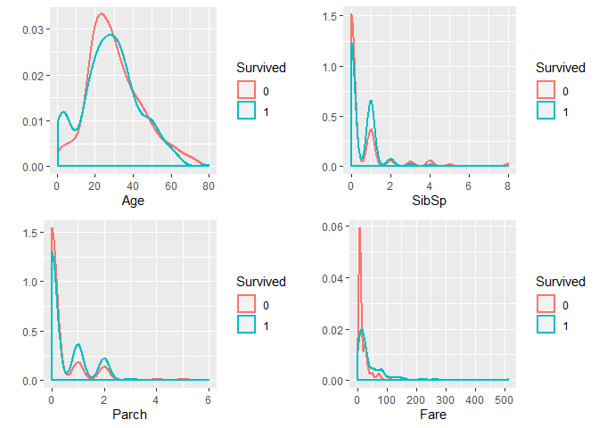
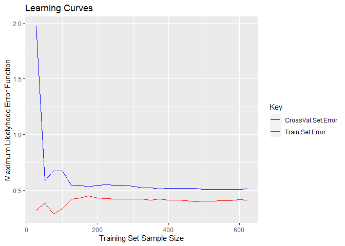

-   [Exploratory Data Analysis and
    Pre-processing](#exploratory-data-analysis-and-pre-processing)
    -   [Getting the Data](#getting-the-data)
    -   [Data Pre-processing](#data-pre-processing)
    -   [Exploratory Data Analysis](#exploratory-data-analysis)
    -   [Impute Missing Data](#impute-missing-data)
    -   [Learning Curves](#learning-curves)
-   [Parametric Models](#parametric-models)
    -   [Un-penalised Logistic Regression with hand-crafted Feature
        Engineering](#un-penalised-logistic-regression-with-hand-crafted-feature-engineering)
    -   [Support Vector Machine with Various
        Kernels](#support-vector-machine-with-various-kernels)
    -   [Neural Networks](#neural-networks)
-   [Non-parametric models](#non-parametric-models)
    -   [Random Forest](#random-forest)
-   [Bagged Trees](#bagged-trees)
    -   [Boosted Trees](#boosted-trees)
-   [Predictions](#predictions)
    -   [Random Forest](#random-forest-1)
    -   [Bagged Tree Ensemble](#bagged-tree-ensemble)
    -   [Boosted Tree Ensemble](#boosted-tree-ensemble)
    -   [Un-penalised Logistic Regression with hand-crafted Feature
        Engineering](#un-penalised-logistic-regression-with-hand-crafted-feature-engineering-1)
-   [Conclusion](#conclusion)

    na.count = function (dat){
      dat %>% apply(., 2, is.na) %>% apply(.,2,sum) %>% .[.!=0]
    }

Exploratory Data Analysis and Pre-processing
--------------------------------------------

### Getting the Data

1.  We start by getting a sense of the train set and its structure.

<!-- -->

    train = read.csv("./data/train.csv")

    head(train)

    ##   PassengerId Survived Pclass
    ## 1           1        0      3
    ## 2           2        1      1
    ## 3           3        1      3
    ## 4           4        1      1
    ## 5           5        0      3
    ## 6           6        0      3
    ##                                                  Name    Sex Age SibSp
    ## 1                             Braund, Mr. Owen Harris   male  22     1
    ## 2 Cumings, Mrs. John Bradley (Florence Briggs Thayer) female  38     1
    ## 3                              Heikkinen, Miss. Laina female  26     0
    ## 4        Futrelle, Mrs. Jacques Heath (Lily May Peel) female  35     1
    ## 5                            Allen, Mr. William Henry   male  35     0
    ## 6                                    Moran, Mr. James   male  NA     0
    ##   Parch           Ticket    Fare Cabin Embarked
    ## 1     0        A/5 21171  7.2500              S
    ## 2     0         PC 17599 71.2833   C85        C
    ## 3     0 STON/O2. 3101282  7.9250              S
    ## 4     0           113803 53.1000  C123        S
    ## 5     0           373450  8.0500              S
    ## 6     0           330877  8.4583              Q

    str(train)

    ## 'data.frame':    891 obs. of  12 variables:
    ##  $ PassengerId: int  1 2 3 4 5 6 7 8 9 10 ...
    ##  $ Survived   : int  0 1 1 1 0 0 0 0 1 1 ...
    ##  $ Pclass     : int  3 1 3 1 3 3 1 3 3 2 ...
    ##  $ Name       : Factor w/ 891 levels "Abbing, Mr. Anthony",..: 109 191 358 277 16 559 520 629 417 581 ...
    ##  $ Sex        : Factor w/ 2 levels "female","male": 2 1 1 1 2 2 2 2 1 1 ...
    ##  $ Age        : num  22 38 26 35 35 NA 54 2 27 14 ...
    ##  $ SibSp      : int  1 1 0 1 0 0 0 3 0 1 ...
    ##  $ Parch      : int  0 0 0 0 0 0 0 1 2 0 ...
    ##  $ Ticket     : Factor w/ 681 levels "110152","110413",..: 524 597 670 50 473 276 86 396 345 133 ...
    ##  $ Fare       : num  7.25 71.28 7.92 53.1 8.05 ...
    ##  $ Cabin      : Factor w/ 148 levels "","A10","A14",..: 1 83 1 57 1 1 131 1 1 1 ...
    ##  $ Embarked   : Factor w/ 4 levels "","C","Q","S": 4 2 4 4 4 3 4 4 4 2 ...

1.  We add a column "Survived" to the test set and assign a default
    value of "0".
2.  Finally, we combide train and test sets, for easier changes to the
    dataframe structure, imputing missing values and analysis.

<!-- -->

    test = read.csv("./data/test.csv")
    test$Survived = 0

    dat = rbind(train, test)
    indx = 1:nrow(train)

### Data Pre-processing

We run the following data pre-processing steps: 1. Convert the feature
type for `Survived`, `Pclass` from `<int>` to `<fctr>`. 2. Convert the
feature type for `Name`, `Cabin` from `<fctr>` to `<char>`. 3. Convert
the feature type for `Ticket` from `<fct>` to `<int>`.

Finally, we get separate the train and test data sets.

    dat$Survived = factor(dat$Survived)
    dat$Pclass = factor(dat$Pclass)
    dat$Name = as.character(dat$Name)
    dat$Cabin = as.character(dat$Cabin)
    dat$Ticket = as.integer(dat$Ticket)
    str(dat)

    ## 'data.frame':    1309 obs. of  12 variables:
    ##  $ PassengerId: int  1 2 3 4 5 6 7 8 9 10 ...
    ##  $ Survived   : Factor w/ 2 levels "0","1": 1 2 2 2 1 1 1 1 2 2 ...
    ##  $ Pclass     : Factor w/ 3 levels "1","2","3": 3 1 3 1 3 3 1 3 3 2 ...
    ##  $ Name       : chr  "Braund, Mr. Owen Harris" "Cumings, Mrs. John Bradley (Florence Briggs Thayer)" "Heikkinen, Miss. Laina" "Futrelle, Mrs. Jacques Heath (Lily May Peel)" ...
    ##  $ Sex        : Factor w/ 2 levels "female","male": 2 1 1 1 2 2 2 2 1 1 ...
    ##  $ Age        : num  22 38 26 35 35 NA 54 2 27 14 ...
    ##  $ SibSp      : int  1 1 0 1 0 0 0 3 0 1 ...
    ##  $ Parch      : int  0 0 0 0 0 0 0 1 2 0 ...
    ##  $ Ticket     : int  524 597 670 50 473 276 86 396 345 133 ...
    ##  $ Fare       : num  7.25 71.28 7.92 53.1 8.05 ...
    ##  $ Cabin      : chr  "" "C85" "" "C123" ...
    ##  $ Embarked   : Factor w/ 4 levels "","C","Q","S": 4 2 4 4 4 3 4 4 4 2 ...

    train = dat[indx,]
    test = dat[-indx,]
    rm(dat)

### Exploratory Data Analysis

1.  From the list of features available, it is reasonable to guess that
    the survival of a passenger would likely **not** depend on `Name`,
    `Ticket` and `Cabin`.
2.  For the remaining features we get a distribution of their respective
    values for the train and test set to ascertain any significant
    differences between the two.

<!-- -->

    plot.age = ggplot()+ 
        geom_density(data = train, aes(x=Age, fill = "Train"), size = 1, na.rm = TRUE, alpha = 0.5)+ 
        geom_density(data = test, aes(x=Age, fill = "Test"), size = 1, na.rm = TRUE, alpha = 0.5)+
        scale_fill_manual(name = "Subsets", values = c(Train = "red", Test = "blue"))+ ylab("")
    plot.sibsp = ggplot()+ 
        geom_density(data = train, aes(x=SibSp, fill = "Train"), size = 1, na.rm = TRUE, alpha = 0.5)+ 
        geom_density(data = test, aes(x=SibSp, fill = "Test"), size = 1, na.rm = TRUE, alpha = 0.5)+
        scale_fill_manual(name = "Subsets", values = c(Train = "red", Test = "blue"))+ ylab("")
    plot.parch = ggplot()+ 
        geom_density(data = train, aes(x=Parch, fill = "Train"), size = 1, na.rm = TRUE, alpha = 0.5)+ 
        geom_density(data = test, aes(x=Parch, fill = "Test"), size = 1, na.rm = TRUE, alpha = 0.5)+
        scale_fill_manual(name = "Subsets", values = c(Train = "red", Test = "blue"))+ ylab("")
    plot.fare = ggplot()+ 
        geom_density(data = train, aes(x=Fare, fill = "Train"), size = 1, na.rm = TRUE, alpha = 0.5)+ 
        geom_density(data = test, aes(x=Fare, fill = "Test"), size = 1, na.rm = TRUE, alpha = 0.5)+
        scale_fill_manual(name = "Subsets", values = c(Train = "red", Test = "blue"))+ ylab("")
    grid.arrange(plot.age, plot.sibsp, plot.parch, plot.fare, ncol = 2)

    train.subset = table(train$Pclass) %>% prop.table() %>% round(4) %>% as.vector()
    test.subset = table(test$Pclass) %>% prop.table() %>% round(4) %>% as.vector()
    table.pclass = rbind(train.subset, test.subset); colnames(table.pclass) = levels(train$Pclass)
    writeLines("\nProportion of passengers stratified by Passenger Class")

    ## 
    ## Proportion of passengers stratified by Passenger Class

    table.pclass

    ##                   1      2      3
    ## train.subset 0.2424 0.2065 0.5511
    ## test.subset  0.2560 0.2225 0.5215

    train.subset = table(train$Sex) %>% prop.table() %>% round(4) %>% as.vector()
    test.subset = table(test$Sex) %>% prop.table() %>% round(4) %>% as.vector()
    table.sex = rbind(train.subset, test.subset); colnames(table.sex) = levels(train$Sex)
    writeLines("\nProportion of passengers stratified by Passenger Sex")

    ## 
    ## Proportion of passengers stratified by Passenger Sex

    table.sex

    ##              female   male
    ## train.subset 0.3524 0.6476
    ## test.subset  0.3636 0.6364

    train.subset = table(train$Embarked) %>% prop.table() %>% round(4) %>% as.vector()
    test.subset = table(test$Embarked) %>% prop.table() %>% round(4) %>% as.vector()
    table.embarked = rbind(train.subset, test.subset); colnames(table.embarked) = levels(train$Embarked) 
    writeLines("\nProportion of passengers stratified by Passenger Embarkation Port")

    ## 
    ## Proportion of passengers stratified by Passenger Embarkation Port

    table.embarked

    ##                          C      Q      S
    ## train.subset 0.0022 0.1886 0.0864 0.7228
    ## test.subset  0.0000 0.2440 0.1100 0.6459

1.  There doesn't seem to be any meaningful difference in the
    distribution of features between the train and test set, except for
    `Embarked` where the test set has less of proportion of passengers
    boarding from **S**.
    1.  There are some passengers in train set that are reporting
        `<blank>` under `Embarked` but there are none like these in the
        test set.
2.  We now get for the train set features, distribution of their
    respective values for the Survivors and non-Survivors.
3.  We tabulate the features in the train set that report `NA`s.

<!-- -->

    plot.age = train %>% ggplot(aes(Age, color = Survived))+ geom_density(size = 1, na.rm = TRUE)+ ylab("")
    plot.sibsp = train %>% ggplot(aes(SibSp, color = Survived))+ geom_density(size = 1, na.rm = TRUE)+ ylab("")
    plot.parch = train %>% ggplot(aes(Parch, color = Survived))+ geom_density(size = 1, na.rm = TRUE)+ ylab("")
    plot.fare = train %>% ggplot(aes(Fare, color = Survived))+ geom_density(size = 1, na.rm = TRUE)+ ylab("")
    grid.arrange(plot.age, plot.sibsp, plot.parch, plot.fare)

    writeLines("\nSurvival Rate as a function of factor variables\n")

    ## 
    ## Survival Rate as a function of factor variables

    table(Survived = train$Survived, Pclass = train$Pclass) %>% prop.table(2) %>% round(digits = 4)

    ##         Pclass
    ## Survived      1      2      3
    ##        0 0.3704 0.5272 0.7576
    ##        1 0.6296 0.4728 0.2424

    table(Survived = train$Survived, Sex = train$Sex) %>% prop.table(2) %>% round(digits = 4)

    ##         Sex
    ## Survived female   male
    ##        0 0.2580 0.8111
    ##        1 0.7420 0.1889

    table(Survived = train$Survived, Embarked = train$Embarked) %>% prop.table(2) %>% round(digits = 4)

    ##         Embarked
    ## Survived             C      Q      S
    ##        0 0.0000 0.4464 0.6104 0.6630
    ##        1 1.0000 0.5536 0.3896 0.3370

    writeLines("\n")

    writeLines("The table below enumerates the features from the train set that report NA values:\n")

    ## The table below enumerates the features from the train set that report NA values:

    na.count(train)

    ## Age 
    ## 177

We note, visually, that: 1. There doesn't seem to be a correlation
between `Survived` and `Age`, or `SibSp`, or `Parch` or `Fare`. 2. There
is a definite correlation between `Survived` and `Pclass`, and `Sex`,
and `Embarked`. 3. There are some examples in train dataset that have a
`<blank>` under the `Embarked` feature and may need imputation. 4.
Finally, the `Age` feature reports 177 `NA`

1.  We get some insight into `Age` by looking at its distribution along
    `Pclass` and `Sex`.
2.  We also identify the passenger that are reporting `<blank>` under
    `Embarked`.

<!-- -->

    train %>% ggplot(aes(Age))+ geom_density(na.rm = TRUE)+ facet_grid(Pclass~Sex)

    writeLines("Who is reporting NA under Age?\n")

    ## Who is reporting NA under Age?

    table(Missing_Age = is.na(train$Age), Passenger_Class = train$Pclass, Sex = train$Sex) %>% 
        prop.table(margin = 2) %>% round(digits = 2)

    ## , , Sex = female
    ## 
    ##            Passenger_Class
    ## Missing_Age    1    2    3
    ##       FALSE 0.39 0.40 0.21
    ##       TRUE  0.04 0.01 0.09
    ## 
    ## , , Sex = male
    ## 
    ##            Passenger_Class
    ## Missing_Age    1    2    3
    ##       FALSE 0.47 0.54 0.52
    ##       TRUE  0.10 0.05 0.19

    writeLines("Who are the passengers reporing <blank> under Embarked?\n")

    ## Who are the passengers reporing <blank> under Embarked?

    train[train$Embarked == "", ]

    ##     PassengerId Survived Pclass                                      Name
    ## 62           62        1      1                       Icard, Miss. Amelie
    ## 830         830        1      1 Stone, Mrs. George Nelson (Martha Evelyn)
    ##        Sex Age SibSp Parch Ticket Fare Cabin Embarked
    ## 62  female  38     0     0     33   80   B28         
    ## 830 female  62     0     0     33   80   B28

1.  The age distributions are approximately normal in all the six
    classes; however their means differ - decreasing with increasing
    passenger class number and men are older than women. Also, the `NA`
    under `Age` come from all the six classes above.
    1.  To impute missing values for `Age`, we get the median values for
        the six classes above
2.  Two passengers are reporing `<blank>` under `Embarked`; both are
    travelling together but without any other siblings or parents on
    board.
    1.  To identify where these two passengers embarked, We get the
        median fares paid by passengers in first class from the 3
        embarkation ports to compare with the fare that these two
        passengers paid.

<!-- -->

    age.medians = train %>% group_by(Pclass, Sex) %>% summarise(med = median(Age, na.rm = TRUE))

    train %>% filter(Pclass == 1) %>% group_by(Embarked) %>% summarise(median(Fare))

    ## # A tibble: 4 x 2
    ##   Embarked `median(Fare)`
    ##   <fct>             <dbl>
    ## 1 ""                 80  
    ## 2 C                  78.3
    ## 3 Q                  90  
    ## 4 S                  52

### Impute Missing Data

1.  Comparing the fares they paid with median fares for other first
    class passengers, the 2 passengers with `<blank>` for `Embarked`
    most likely boarded from **C**. We therefore impute this value to
    `Embarked` in these two cases.
2.  We impute the median age of the class (function of `Pclass` and
    `Sex`) to `NA` under `Age`

<!-- -->

    train[train$Embarked == "", "Embarked"] = "C"
    train$Embarked = droplevels(train$Embarked)     #   Dropping the unused level
    test$Embarked = droplevels(test$Embarked)       #   Repeating the step above for test subset

    train[is.na(train$Age) & train$Pclass == 1 & train$Sex == "male", "Age"] = 
        age.medians[age.medians$Pclass == 1 & age.medians$Sex == "male", "med"]
    train[is.na(train$Age) & train$Pclass == 2 & train$Sex == "male", "Age"] = 
        age.medians[age.medians$Pclass == 2 & age.medians$Sex == "male", "med"]
    train[is.na(train$Age) & train$Pclass == 3 & train$Sex == "male", "Age"] = 
        age.medians[age.medians$Pclass == 3 & age.medians$Sex == "male", "med"]
    train[is.na(train$Age) & train$Pclass == 1 & train$Sex == "female", "Age"] = 
        age.medians[age.medians$Pclass == 1 & age.medians$Sex == "female", "med"]
    train[is.na(train$Age) & train$Pclass == 2 & train$Sex == "female", "Age"] = 
        age.medians[age.medians$Pclass == 2 & age.medians$Sex == "female", "med"]
    train[is.na(train$Age) & train$Pclass == 3 & train$Sex == "female", "Age"] = 
        age.medians[age.medians$Pclass == 3 & age.medians$Sex == "female", "med"]

    na.count(train)

    ## named integer(0)

We have now cleaned the train dataset.

1.  We make a reasonable assumption that the survival of a passenger is
    not dependent on his/her `Name`, `Ticket` and `Cabin`. For easier
    subsequent handling, we drop the non-essential features from the
    train set. Finally, we save a baseline version of the updated train
    set for future reference.
2.  We make the similar changes (of dropping the non-essential features)
    from the test set and tabulate the missing data in the set.

<!-- -->

    feature.set = c("Survived", "Pclass", "Sex", "Age", "SibSp", "Parch", "Fare", "Embarked")
    train = train[, feature.set]
    saveRDS(train, "./RDA/train.Rda")

    test = test[, feature.set]

    writeLines("The table below enumerates the features from the test dataset that report NA values:\n")

    ## The table below enumerates the features from the test dataset that report NA values:

    na.count(test)

    ##  Age Fare 
    ##   86    1

1.  In the test set, the `Age` feature reports 86 `NA`s. To these, we
    impute the median age of the relevant class (function of `Pclass`
    and `Sex`) from the **train** subset.
2.  We also identify the passenger record reporting `NA` inder `Fare`

<!-- -->

    test[is.na(test$Age) & test$Pclass == 1 & test$Sex == "male", "Age"] = 
        age.medians[age.medians$Pclass == 1 & age.medians$Sex == "male", "med"]
    test[is.na(test$Age) & test$Pclass == 2 & test$Sex == "male", "Age"] = 
        age.medians[age.medians$Pclass == 2 & age.medians$Sex == "male", "med"]
    test[is.na(test$Age) & test$Pclass == 3 & test$Sex == "male", "Age"] = 
        age.medians[age.medians$Pclass == 3 & age.medians$Sex == "male", "med"]
    test[is.na(test$Age) & test$Pclass == 1 & test$Sex == "female", "Age"] = 
        age.medians[age.medians$Pclass == 1 & age.medians$Sex == "female", "med"]
    test[is.na(test$Age) & test$Pclass == 2 & test$Sex == "female", "Age"] = 
        age.medians[age.medians$Pclass == 2 & age.medians$Sex == "female", "med"]
    test[is.na(test$Age) & test$Pclass == 3 & test$Sex == "female", "Age"] = 
        age.medians[age.medians$Pclass == 3 & age.medians$Sex == "female", "med"]

    test[is.na(test$Fare),]

    ##      Survived Pclass  Sex  Age SibSp Parch Fare Embarked
    ## 1044        0      3 male 60.5     0     0   NA        S

1.  The passenger record reporting `NA` under `Fare` also reports
    `Pclass` = 3 and `Embarked` = S. To this `NA`, we impute the median
    value of the respective class (function of `Pclass` and `Embarked`)
    from the train subset.
2.  We confirm that the train subset is now clean and save a baseline
    for future reference.

<!-- -->

    test[is.na(test$Fare), "Fare"] = train %>% filter(Pclass == 3 & Embarked == "S") %>% 
                                            summarise(med = median(Fare))
    na.count(test)

    ## named integer(0)

    saveRDS(test, "./RDA/test.Rda")

### Learning Curves

Before proceeding further, it would be worthwhile to draw some Learning
Curves to estimate if a basic logistical regression model suffers from
high bias or high variance. This will inform our feature engineering
better.

    #   We divide the train set into a train subset and a validation subset in the ratio of 70:30
    set.seed(1970)
    indx = sample(nrow(train), 0.7*nrow(train), replace = FALSE)
    lc.steps = 25; lc.step.size = length(indx)/lc.steps
    lc.set.size = seq(lc.step.size, length(indx), length.out = lc.steps) %>% round(digits = 0)

    err.train = rep(0, lc.steps); err.val = err.train
    for (i in 1:lc.steps) {
      glm.fit = glm(Survived~., data = train[indx[1:lc.set.size[i]],], 
                    family = "binomial")
      prob = predict(glm.fit, newdata = train[indx[1:lc.set.size[i]],], type = "response")
      y = train$Survived[indx[1:lc.set.size[i]]]
      y = levels(y)[y] %>% as.numeric()
      err.train[i] = sum(-y*log(prob) - (1-y)*log(1-prob))/(length(y))

      prob = predict(glm.fit, newdata = train[-indx,], type = "response")
      y = train$Survived[-indx]
      y = levels(y)[y] %>% as.numeric()
      err.val[i] = sum(-y*log(prob) - (1-y)*log(1-prob))/(length(y))
    }

    err.df = cbind(Size = lc.set.size, Train = err.train, Val = err.val) %>% as.data.frame()

    err.df %>% ggplot(aes(x = Size)) + geom_line(aes(y = Train, color = "Train.Set.Error"))+ 
        geom_line(aes(y = Val, color = "CrossVal.Set.Error"))+ 
        labs(title = "Learning Curves", x = "Training Set Sample Size", y = "Maximum Likelyhood Error Function")+
        scale_colour_manual(name="Key", values=c(Train.Set.Error ="red", CrossVal.Set.Error ="blue"))

1.  The rapid and almost converged learning curves for the train and
    cross-validation subsets indicate that an un-penalised logistic
    regression model will suffers from high bias and if we are to
    improve the performance of our model then we will need to build a
    model that uses additional features (feature interaction terms,
    feature power terms, etc).

2.  To help evaluate the relative performance of differnt models built,
    we will establish a baseline performance measure for test set
    prediction accuracy using an un-penalised logistic regression model.

<!-- -->

    m = nrow(train)
    est.test.err = 0
    for (k in 1:5) {
        set.seed(k)
        indx = sample(1:m, 0.75*m)
        fit = glm(Survived~., data = train[indx,], family = "binomial")
        prob = predict(glm.fit, newdata = train[indx,], type = "response")
        pred = ROCR::prediction(prob, train$Survived[indx])
        perf = performance(pred, measure = "acc")
        max.acc.indx = perf@y.values %>% unlist() %>% as.vector() %>% which.max()
        bestcutoff = perf@x.values %>% unlist %>% as.vector() %>% .[max.acc.indx]
        
        prob = predict(glm.fit, newdata = train[-indx,], type = "response")
        pred = ifelse(prob < bestcutoff, 0, 1)
        test.err = mean(pred != train$Survived[-indx])
        est.test.err = test.err + est.test.err
    }

    print(paste("The estimated test error using an unpenalised logistic regression is", 
                round(est.test.err/5, digits = 4), sep = " "))

    ## [1] "The estimated test error using an unpenalised logistic regression is 0.1767"

1.  We will build different types of prediction models:

    1.  Parametric Models
        1.  Un-penalised logistic regression with feature engineering
        2.  SVM with different kernels
        3.  Neural Networks
    2.  Non-parametric models
        1.  Tree based ensembles

<!-- -->

    #   Cleanup to release memory and reduce variable clutter
    rm(list = ls(pattern = "plot")); rm(list = ls(pattern = "table")); rm(list = ls(pattern = "lc"))
    rm(age.medians, err.df, perf, err.train, err.val, feature.set, test.subset, train.subset)
    gc()

    ##           used (Mb) gc trigger  (Mb) max used  (Mb)
    ## Ncells 1901674 58.1    4182245 127.7  4182245 127.7
    ## Vcells 2324400 17.8    8388608  64.0  8388381  64.0

Parametric Models
-----------------

### Un-penalised Logistic Regression with hand-crafted Feature Engineering

1.  We employ the *train-test* strategy on the train set to choose the
    optimal parameters for the different models and estimate test error
    for a learning algorithm based on such a model.
2.  We will make multiple passes to fit a logistic regression model,
    each pass learning from the previous one
3.  At each pass we will use the p-values of the included features to
    decide on additional features to be included or engineered.

#### Logistic Regression: Pass 1

1.  We begin with an unpenalised logistic regression that includes all
    features.
2.  We divide the train set 60:40 into train and test subsets.
3.  We do a 5-cycle validation to estimate the likely test error.

<!-- -->

    f1 = paste("Survived", "~", ".", sep = "")
    F = as.formula(f1)

    est.test.err = 0
    for (k in 1:5) {
        set.seed(k)
        indx = sample(1:m, 0.6*m)
        fit = glm(F, data = train[indx,], family = "binomial") 
        prob = predict(fit, newdata = train[indx,], type = "response") 
        pred = ROCR::prediction(prob, train$Survived[indx])
        perf = performance(pred, measure = "acc") 
        bestaccindx = perf@y.values %>% unlist() %>% which.max() 
        bestcutoff = perf@x.values %>% unlist() %>% .[bestaccindx] 
        
        prob = predict(fit, newdata = train[-indx,], type = "response") 
        pred = ifelse(prob < bestcutoff, 0, 1) 
        test.err = mean(pred != train$Survived[-indx])
        est.test.err = test.err + est.test.err
    }

    print(paste("The estimated test error using this logistic fit is", 
                round(est.test.err/5, digits = 4), sep = " "))

    ## [1] "The estimated test error using this logistic fit is 0.186"

    fit = glm(F, data = train, family = "binomial")

    summary(fit)

    ## 
    ## Call:
    ## glm(formula = F, family = "binomial", data = train)
    ## 
    ## Deviance Residuals: 
    ##     Min       1Q   Median       3Q      Max  
    ## -2.6952  -0.6026  -0.4076   0.6148   2.4938  
    ## 
    ## Coefficients:
    ##              Estimate Std. Error z value Pr(>|z|)    
    ## (Intercept)  4.328766   0.495394   8.738  < 2e-16 ***
    ## Pclass2     -1.057640   0.305214  -3.465  0.00053 ***
    ## Pclass3     -2.350519   0.312693  -7.517 5.60e-14 ***
    ## Sexmale     -2.698870   0.201850 -13.371  < 2e-16 ***
    ## Age         -0.043214   0.008233  -5.249 1.53e-07 ***
    ## SibSp       -0.343676   0.110323  -3.115  0.00184 ** 
    ## Parch       -0.088697   0.120128  -0.738  0.46030    
    ## Fare         0.001970   0.002454   0.803  0.42224    
    ## EmbarkedQ   -0.146866   0.384275  -0.382  0.70232    
    ## EmbarkedS   -0.414524   0.240379  -1.724  0.08462 .  
    ## ---
    ## Signif. codes:  0 '***' 0.001 '**' 0.01 '*' 0.05 '.' 0.1 ' ' 1
    ## 
    ## (Dispersion parameter for binomial family taken to be 1)
    ## 
    ##     Null deviance: 1186.66  on 890  degrees of freedom
    ## Residual deviance:  780.63  on 881  degrees of freedom
    ## AIC: 800.63
    ## 
    ## Number of Fisher Scoring iterations: 5

#### Logistic Regression: Pass 2

1.  The p-values for features indicate that `Parch` and `Fare` are not
    significant to the model. However we do not drop these features at
    this point.
2.  We now add engineered features. From the EDA we remember that
    `Survived` was co-related to `Pclass`, `Sex` and `Embarked`. We add
    interaction terms including these features to our model.

<!-- -->

    f2 = paste(f1, "+Pclass:Sex+Pclass:Embarked+Sex:Embarked", sep = "")
    F = as.formula(f2)

    est.test.err = 0
    for (k in 1:5) {
        set.seed(k)
        indx = sample(1:m, 0.6*m)
        fit = glm(F, data = train[indx,], family = "binomial") 
        prob = predict(fit, newdata = train[indx,], type = "response") 
        pred = ROCR::prediction(prob, train$Survived[indx]) 
        perf = performance(pred, measure = "acc") 
        bestaccindx = perf@y.values %>% unlist() %>% which.max() 
        bestcutoff = perf@x.values %>% unlist() %>% .[bestaccindx] 
        
        prob = predict(fit, newdata = train[-indx,], type = "response") 
        pred = ifelse(prob < bestcutoff, 0, 1) 
        test.err = mean(pred != train$Survived[-indx])
        est.test.err = test.err + est.test.err
    }

    print(paste("The estimated test error using this logistic fit is", 
                round(est.test.err/5, digits = 4), sep = " "))

    ## [1] "The estimated test error using this logistic fit is 0.1843"

    fit = glm(F, data = train, family = "binomial")

    summary(fit)

    ## 
    ## Call:
    ## glm(formula = F, family = "binomial", data = train)
    ## 
    ## Deviance Residuals: 
    ##     Min       1Q   Median       3Q      Max  
    ## -3.1484  -0.6165  -0.4245   0.3730   2.5803  
    ## 
    ## Coefficients:
    ##                    Estimate Std. Error z value Pr(>|z|)    
    ## (Intercept)        5.547643   0.851273   6.517 7.18e-11 ***
    ## Pclass2           -0.827825   1.130678  -0.732 0.464078    
    ## Pclass3           -3.854898   0.794937  -4.849 1.24e-06 ***
    ## Sexmale           -4.048807   0.710899  -5.695 1.23e-08 ***
    ## Age               -0.048690   0.009117  -5.341 9.26e-08 ***
    ## SibSp             -0.293331   0.112522  -2.607 0.009137 ** 
    ## Parch             -0.011057   0.129056  -0.086 0.931726    
    ## Fare               0.001187   0.002494   0.476 0.634180    
    ## EmbarkedQ         -0.525939   3.753068  -0.140 0.888553    
    ## EmbarkedS         -0.365611   0.649159  -0.563 0.573295    
    ## Pclass2:Sexmale   -0.576145   0.840869  -0.685 0.493232    
    ## Pclass3:Sexmale    2.348804   0.697187   3.369 0.000754 ***
    ## Pclass2:EmbarkedQ  1.342344   5.544150   0.242 0.808688    
    ## Pclass3:EmbarkedQ  0.958971   3.746369   0.256 0.797971    
    ## Pclass2:EmbarkedS -0.272196   0.887195  -0.307 0.758991    
    ## Pclass3:EmbarkedS -0.452676   0.541778  -0.836 0.403415    
    ## Sexmale:EmbarkedQ -1.579089   0.891687  -1.771 0.076577 .  
    ## Sexmale:EmbarkedS  0.256758   0.568990   0.451 0.651807    
    ## ---
    ## Signif. codes:  0 '***' 0.001 '**' 0.01 '*' 0.05 '.' 0.1 ' ' 1
    ## 
    ## (Dispersion parameter for binomial family taken to be 1)
    ## 
    ##     Null deviance: 1186.66  on 890  degrees of freedom
    ## Residual deviance:  740.75  on 873  degrees of freedom
    ## AIC: 776.75
    ## 
    ## Number of Fisher Scoring iterations: 6

#### Logistic Regression: Pass 3

1.  The estimated test error has decreased.
2.  From the summary we infer:
    1.  the interaction term `Pclass:Sex` is significant but
        `Pclass:Embarked` isn't. We make the necessary changes and rerun
        the model.
    2.  the term `Embarked` is not significant. However, since we are
        retaining the interaction term `Sex:Embarked`, we retain the
        `Embarked` term as well. We also remember from the EDA that the
        test subset had a noticable difference for `Embarked` from the
        train subset and that is another reason to retain the term.

<!-- -->

    f3 = paste(f1, "+Pclass:Sex+Sex:Embarked", sep = "")
    F = as.formula(f3)

    est.test.err = 0
    for (k in 1:5) {
        set.seed(k)
        indx = sample(1:m, 0.6*m)
        fit = glm(F, data = train[indx,], family = "binomial") 
        prob = predict(fit, newdata = train[indx,], type = "response") 
        pred = ROCR::prediction(prob, train$Survived[indx]) 
        perf = performance(pred, measure = "acc") 
        bestaccindx = perf@y.values %>% unlist() %>% which.max() 
        bestcutoff = perf@x.values %>% unlist() %>% .[bestaccindx] 
        
        prob = predict(fit, newdata = train[-indx,], type = "response") 
        pred = ifelse(prob < bestcutoff, 0, 1) 
        test.err = mean(pred != train$Survived[-indx])
        est.test.err = test.err + est.test.err
    }

    print(paste("The estimated test error using this logistic fit is", 
                round(est.test.err/5, digits = 4), sep = " "))

    ## [1] "The estimated test error using this logistic fit is 0.1776"

    fit = glm(F, data = train, family = "binomial")

    summary(fit)

    ## 
    ## Call:
    ## glm(formula = F, family = "binomial", data = train)
    ## 
    ## Deviance Residuals: 
    ##     Min       1Q   Median       3Q      Max  
    ## -3.0963  -0.6241  -0.4232   0.3710   2.5799  
    ## 
    ## Coefficients:
    ##                    Estimate Std. Error z value Pr(>|z|)    
    ## (Intercept)        5.819690   0.802527   7.252 4.12e-13 ***
    ## Pclass2           -0.977815   0.775646  -1.261 0.207436    
    ## Pclass3           -4.173134   0.695938  -5.996 2.02e-09 ***
    ## Sexmale           -4.140246   0.718383  -5.763 8.25e-09 ***
    ## Age               -0.048884   0.009094  -5.375 7.64e-08 ***
    ## SibSp             -0.294856   0.112044  -2.632 0.008498 ** 
    ## Parch             -0.007238   0.128482  -0.056 0.955074    
    ## Fare               0.000799   0.002452   0.326 0.744557    
    ## EmbarkedQ          0.484001   0.577215   0.839 0.401744    
    ## EmbarkedS         -0.748341   0.463720  -1.614 0.106575    
    ## Pclass2:Sexmale   -0.626989   0.827716  -0.757 0.448755    
    ## Pclass3:Sexmale    2.320626   0.691491   3.356 0.000791 ***
    ## Sexmale:EmbarkedQ -1.482915   0.880416  -1.684 0.092117 .  
    ## Sexmale:EmbarkedS  0.404610   0.542543   0.746 0.455809    
    ## ---
    ## Signif. codes:  0 '***' 0.001 '**' 0.01 '*' 0.05 '.' 0.1 ' ' 1
    ## 
    ## (Dispersion parameter for binomial family taken to be 1)
    ## 
    ##     Null deviance: 1186.66  on 890  degrees of freedom
    ## Residual deviance:  741.57  on 877  degrees of freedom
    ## AIC: 769.57
    ## 
    ## Number of Fisher Scoring iterations: 6

#### Logistic Regression: Pass 4

1.  The estimated test error has reduced.
2.  We add a third order interaction terms for the three variables
    `Pclass`, `Sex`, `Embarked`.
3.  We also add interaction terms for `Pclass` and `Age` & `Sex` and
    `Age` as these features are stratified differently.

<!-- -->

    f4 = paste(f3, "+Pclass:Sex:Embarked+Pclass:Age+Sex:Age", sep = "")
    F = as.formula(f4)

    est.test.err = 0
    for (k in 1:5) {
        set.seed(k)
        indx = sample(1:m, 0.6*m)
        fit = glm(F, data = train[indx,], family = "binomial") 
        prob = predict(fit, newdata = train[indx,], type = "response") 
        pred = ROCR::prediction(prob, train$Survived[indx]) 
        perf = performance(pred, measure = "acc") 
        bestaccindx = perf@y.values %>% unlist() %>% which.max() 
        bestcutoff = perf@x.values %>% unlist() %>% .[bestaccindx] 
        
        prob = predict(fit, newdata = train[-indx,], type = "response") 
        pred = ifelse(prob < bestcutoff, 0, 1) 
        test.err = mean(pred != train$Survived[-indx])
        est.test.err = test.err + est.test.err
    }

    print(paste("The estimated test error using this logistic fit is", 
                round(est.test.err/5, digits = 4), sep = " "))

    ## [1] "The estimated test error using this logistic fit is 0.1793"

    fit = glm(F, data = train, family = "binomial")

    summary(fit)

    ## 
    ## Call:
    ## glm(formula = F, family = "binomial", data = train)
    ## 
    ## Deviance Residuals: 
    ##     Min       1Q   Median       3Q      Max  
    ## -2.8178  -0.6435  -0.4034   0.3449   3.2673  
    ## 
    ## Coefficients:
    ##                               Estimate Std. Error z value Pr(>|z|)  
    ## (Intercept)                  3.403e+00  1.348e+00   2.524   0.0116 *
    ## Pclass2                      1.353e+01  5.414e+02   0.025   0.9801  
    ## Pclass3                     -2.148e+00  1.379e+00  -1.557   0.1194  
    ## Sexmale                     -2.498e+00  1.294e+00  -1.930   0.0536 .
    ## Age                          9.845e-03  2.356e-02   0.418   0.6761  
    ## SibSp                       -2.976e-01  1.157e-01  -2.572   0.0101 *
    ## Parch                       -7.718e-02  1.298e-01  -0.595   0.5521  
    ## Fare                         1.927e-03  2.538e-03   0.759   0.4477  
    ## EmbarkedQ                    1.196e+01  1.455e+03   0.008   0.9934  
    ## EmbarkedS                   -5.259e-01  1.248e+00  -0.421   0.6735  
    ## Pclass2:Sexmale             -1.315e+01  5.414e+02  -0.024   0.9806  
    ## Pclass3:Sexmale              1.813e+00  1.259e+00   1.441   0.1497  
    ## Sexmale:EmbarkedQ           -2.647e+01  2.058e+03  -0.013   0.9897  
    ## Sexmale:EmbarkedS            4.640e-01  1.314e+00   0.353   0.7241  
    ## Pclass2:Age                 -6.705e-02  2.634e-02  -2.545   0.0109 *
    ## Pclass3:Age                 -3.527e-02  2.223e-02  -1.587   0.1125  
    ## Sexmale:Age                 -4.494e-02  2.082e-02  -2.159   0.0309 *
    ## Pclass2:Sexfemale:EmbarkedQ -1.169e+01  1.863e+03  -0.006   0.9950  
    ## Pclass3:Sexfemale:EmbarkedQ -1.161e+01  1.455e+03  -0.008   0.9936  
    ## Pclass2:Sexmale:EmbarkedQ    3.448e+00  2.058e+03   0.002   0.9987  
    ## Pclass3:Sexmale:EmbarkedQ    1.331e+01  1.455e+03   0.009   0.9927  
    ## Pclass2:Sexfemale:EmbarkedS -1.204e+01  5.414e+02  -0.022   0.9823  
    ## Pclass3:Sexfemale:EmbarkedS -2.935e-01  1.350e+00  -0.217   0.8279  
    ## Pclass2:Sexmale:EmbarkedS   -2.476e-01  1.042e+00  -0.238   0.8121  
    ## Pclass3:Sexmale:EmbarkedS   -5.856e-01  5.901e-01  -0.992   0.3210  
    ## ---
    ## Signif. codes:  0 '***' 0.001 '**' 0.01 '*' 0.05 '.' 0.1 ' ' 1
    ## 
    ## (Dispersion parameter for binomial family taken to be 1)
    ## 
    ##     Null deviance: 1186.66  on 890  degrees of freedom
    ## Residual deviance:  729.73  on 866  degrees of freedom
    ## AIC: 779.73
    ## 
    ## Number of Fisher Scoring iterations: 14

#### Logistic Regression: Pass 5

1.  The estimated test error has increased marginally.
2.  Of the interaction terms added in the last pass, the third order
    term has no significance to the quality of fit but the other two do.
    We drop the third order term and refit the model

<!-- -->

    f5 = paste(f3, "+Pclass:Age+Sex:Age", sep = "")
    F = as.formula(f5)

    est.test.err = 0
    for (k in 1:5) {
        set.seed(k)
        indx = sample(1:m, 0.6*m)
        fit = glm(F, data = train[indx,], family = "binomial") 
        prob = predict(fit, newdata = train[indx,], type = "response") 
        pred = ROCR::prediction(prob, train$Survived[indx]) 
        perf = performance(pred, measure = "acc") 
        bestaccindx = perf@y.values %>% unlist() %>% which.max() 
        bestcutoff = perf@x.values %>% unlist() %>% .[bestaccindx] 
        
        prob = predict(fit, newdata = train[-indx,], type = "response") 
        pred = ifelse(prob < bestcutoff, 0, 1) 
        test.err = mean(pred != train$Survived[-indx])
        est.test.err = test.err + est.test.err
    }

    print(paste("The estimated test error using this logistic fit is", 
                round(est.test.err/5, digits = 4), sep = " "))

    ## [1] "The estimated test error using this logistic fit is 0.1793"

    fit = glm(F, data = train, family = "binomial")

    summary(fit)

    ## 
    ## Call:
    ## glm(formula = F, family = "binomial", data = train)
    ## 
    ## Deviance Residuals: 
    ##     Min       1Q   Median       3Q      Max  
    ## -2.8904  -0.6496  -0.4064   0.3411   3.2775  
    ## 
    ## Coefficients:
    ##                    Estimate Std. Error z value Pr(>|z|)    
    ## (Intercept)        3.700208   1.051283   3.520 0.000432 ***
    ## Pclass2            1.599543   1.205807   1.327 0.184663    
    ## Pclass3           -2.440122   0.983626  -2.481 0.013111 *  
    ## Sexmale           -2.576483   0.983433  -2.620 0.008796 ** 
    ## Age                0.008400   0.023400   0.359 0.719606    
    ## SibSp             -0.296899   0.115168  -2.578 0.009938 ** 
    ## Parch             -0.073335   0.129321  -0.567 0.570662    
    ## Fare               0.001451   0.002497   0.581 0.561208    
    ## EmbarkedQ          0.370141   0.577849   0.641 0.521815    
    ## EmbarkedS         -0.812516   0.466766  -1.741 0.081730 .  
    ## Pclass2:Sexmale   -1.372051   0.888299  -1.545 0.122447    
    ## Pclass3:Sexmale    1.634816   0.730396   2.238 0.025204 *  
    ## Sexmale:EmbarkedQ -1.374360   0.882530  -1.557 0.119400    
    ## Sexmale:EmbarkedS  0.463418   0.545787   0.849 0.395836    
    ## Pclass2:Age       -0.067653   0.026283  -2.574 0.010053 *  
    ## Pclass3:Age       -0.034213   0.022088  -1.549 0.121395    
    ## Sexmale:Age       -0.043708   0.020656  -2.116 0.034343 *  
    ## ---
    ## Signif. codes:  0 '***' 0.001 '**' 0.01 '*' 0.05 '.' 0.1 ' ' 1
    ## 
    ## (Dispersion parameter for binomial family taken to be 1)
    ## 
    ##     Null deviance: 1186.66  on 890  degrees of freedom
    ## Residual deviance:  731.46  on 874  degrees of freedom
    ## AIC: 765.46
    ## 
    ## Number of Fisher Scoring iterations: 6

#### Logistic Regression: Pass 6

1.  The estimated test error remained same.
2.  The interaction term `Sex:Embarked` doesn't seem to be significant
    to the model. So we drop it.

<!-- -->

    f6 = paste(f5, "-Sex:Embarked", sep = "")
    F = as.formula(f6)

    est.test.err = 0
    for (k in 1:5) {
        set.seed(k)
        indx = sample(1:m, 0.6*m)
        fit = glm(F, data = train[indx,], family = "binomial") 
        prob = predict(fit, newdata = train[indx,], type = "response") 
        pred = ROCR::prediction(prob, train$Survived[indx]) 
        perf = performance(pred, measure = "acc") 
        bestaccindx = perf@y.values %>% unlist() %>% which.max() 
        bestcutoff = perf@x.values %>% unlist() %>% .[bestaccindx] 
        
        prob = predict(fit, newdata = train[-indx,], type = "response") 
        pred = ifelse(prob < bestcutoff, 0, 1) 
        test.err = mean(pred != train$Survived[-indx])
        est.test.err = test.err + est.test.err
    }

    print(paste("The estimated test error using this logistic fit is", 
                round(est.test.err/5, digits = 4), sep = " "))

    ## [1] "The estimated test error using this logistic fit is 0.177"

    fit = glm(F, data = train, family = "binomial")

    summary(fit)

    ## 
    ## Call:
    ## glm(formula = F, family = "binomial", data = train)
    ## 
    ## Deviance Residuals: 
    ##     Min       1Q   Median       3Q      Max  
    ## -2.8268  -0.6459  -0.3961   0.3313   3.2999  
    ## 
    ## Coefficients:
    ##                  Estimate Std. Error z value Pr(>|z|)    
    ## (Intercept)      3.505514   1.030658   3.401 0.000671 ***
    ## Pclass2          1.549650   1.205476   1.286 0.198615    
    ## Pclass3         -2.254129   0.987319  -2.283 0.022426 *  
    ## Sexmale         -2.276328   0.932214  -2.442 0.014612 *  
    ## Age              0.008613   0.023450   0.367 0.713406    
    ## SibSp           -0.343198   0.115054  -2.983 0.002855 ** 
    ## Parch           -0.087594   0.128541  -0.681 0.495588    
    ## Fare             0.001417   0.002508   0.565 0.572043    
    ## EmbarkedQ       -0.057374   0.364354  -0.157 0.874877    
    ## EmbarkedS       -0.465047   0.244461  -1.902 0.057127 .  
    ## Pclass2:Sexmale -1.257527   0.877335  -1.433 0.151758    
    ## Pclass3:Sexmale  1.439719   0.717355   2.007 0.044751 *  
    ## Pclass2:Age     -0.069247   0.026353  -2.628 0.008596 ** 
    ## Pclass3:Age     -0.037415   0.022291  -1.679 0.093247 .  
    ## Sexmale:Age     -0.044387   0.020686  -2.146 0.031889 *  
    ## ---
    ## Signif. codes:  0 '***' 0.001 '**' 0.01 '*' 0.05 '.' 0.1 ' ' 1
    ## 
    ## (Dispersion parameter for binomial family taken to be 1)
    ## 
    ##     Null deviance: 1186.66  on 890  degrees of freedom
    ## Residual deviance:  738.23  on 876  degrees of freedom
    ## AIC: 768.23
    ## 
    ## Number of Fisher Scoring iterations: 6

#### Logistic Regression: Pass 7

1.  The estimated test error has decreased slightly but all the features
    in the model except `Fare` and `Parch` are significant to the model.
    Moreover, `Fare` is a function of `Pclass` and `Embarked`, two terms
    that are already part of the model. So we will drop `Fare` from the
    model.
2.  Since `Pclass`,`Sex` and `Age` are important predictor of survival,
    we add interaction terms for `Parch` with these 3 features to
    investigate the impact on the model quality.

<!-- -->

    f7 = paste(f6, "-Fare+Pclass:Parch+Sex:Parch+Age:Parch", sep = "")
    F = as.formula(f7)

    est.test.err = 0
    for (k in 1:5) {
        set.seed(k)
        indx = sample(1:m, 0.6*m)
        fit = glm(F, data = train[indx,], family = "binomial") 
        prob = predict(fit, newdata = train[indx,], type = "response") 
        pred = ROCR::prediction(prob, train$Survived[indx]) 
        perf = performance(pred, measure = "acc") 
        bestaccindx = perf@y.values %>% unlist() %>% which.max() 
        bestcutoff = perf@x.values %>% unlist() %>% .[bestaccindx] 
        
        prob = predict(fit, newdata = train[-indx,], type = "response") 
        pred = ifelse(prob < bestcutoff, 0, 1) 
        test.err = mean(pred != train$Survived[-indx])
        est.test.err = test.err + est.test.err
    }

    print(paste("The estimated test error using this logistic fit is", 
                round(est.test.err/5, digits = 4), sep = " "))

    ## [1] "The estimated test error using this logistic fit is 0.1742"

    fit = glm(F, data = train, family = "binomial")

    summary(fit)

    ## 
    ## Call:
    ## glm(formula = F, family = "binomial", data = train)
    ## 
    ## Deviance Residuals: 
    ##     Min       1Q   Median       3Q      Max  
    ## -3.0061  -0.6083  -0.4092   0.3816   3.0239  
    ## 
    ## Coefficients:
    ##                  Estimate Std. Error z value Pr(>|z|)    
    ## (Intercept)      4.126274   1.197282   3.446 0.000568 ***
    ## Pclass2         -0.138624   1.317920  -0.105 0.916230    
    ## Pclass3         -3.133865   1.103352  -2.840 0.004507 ** 
    ## Sexmale         -3.089593   1.056902  -2.923 0.003464 ** 
    ## Age              0.007623   0.025972   0.294 0.769123    
    ## SibSp           -0.423206   0.123440  -3.428 0.000607 ***
    ## Parch           -0.019905   0.548504  -0.036 0.971052    
    ## EmbarkedQ       -0.065980   0.369364  -0.179 0.858227    
    ## EmbarkedS       -0.489600   0.243830  -2.008 0.044648 *  
    ## Pclass2:Sexmale -0.597631   0.900402  -0.664 0.506858    
    ## Pclass3:Sexmale  1.801168   0.773207   2.329 0.019834 *  
    ## Pclass2:Age     -0.042845   0.027775  -1.543 0.122932    
    ## Pclass3:Age     -0.018223   0.022716  -0.802 0.422437    
    ## Sexmale:Age     -0.035304   0.021550  -1.638 0.101382    
    ## Pclass2:Parch    1.172500   0.525644   2.231 0.025708 *  
    ## Pclass3:Parch    0.300611   0.410013   0.733 0.463453    
    ## Sexmale:Parch    0.548447   0.303154   1.809 0.070429 .  
    ## Age:Parch       -0.019400   0.010725  -1.809 0.070477 .  
    ## ---
    ## Signif. codes:  0 '***' 0.001 '**' 0.01 '*' 0.05 '.' 0.1 ' ' 1
    ## 
    ## (Dispersion parameter for binomial family taken to be 1)
    ## 
    ##     Null deviance: 1186.7  on 890  degrees of freedom
    ## Residual deviance:  724.7  on 873  degrees of freedom
    ## AIC: 760.7
    ## 
    ## Number of Fisher Scoring iterations: 6

#### Logistic Regression: Pass 8

1.  The estimated test error is reduced to its minimum so far.
2.  In the latest model the interaction terms `Pclass:Age` and `Sex:Age`
    are not signifiant to the model. We drop these interaction terms to
    investigate the impact on the quality.

<!-- -->

    f8 = paste(f7, "-Pclass:Age-Sex:Age", sep = "")
    F = as.formula(f8)

    est.test.err = 0
    for (k in 1:5) {
        set.seed(k)
        indx = sample(1:m, 0.6*m)
        fit = glm(F, data = train[indx,], family = "binomial") 
        prob = predict(fit, newdata = train[indx,], type = "response") 
        pred = ROCR::prediction(prob, train$Survived[indx]) 
        perf = performance(pred, measure = "acc") 
        bestaccindx = perf@y.values %>% unlist() %>% which.max() 
        bestcutoff = perf@x.values %>% unlist() %>% .[bestaccindx] 
        
        prob = predict(fit, newdata = train[-indx,], type = "response") 
        pred = ifelse(prob < bestcutoff, 0, 1) 
        test.err = mean(pred != train$Survived[-indx])
        est.test.err = test.err + est.test.err
    }

    print(paste("The estimated test error using this logistic fit is", 
                round(est.test.err/5, digits = 4), sep = " "))

    ## [1] "The estimated test error using this logistic fit is 0.1742"

    fit = glm(F, data = train, family = "binomial")

    summary(fit)

    ## 
    ## Call:
    ## glm(formula = F, family = "binomial", data = train)
    ## 
    ## Deviance Residuals: 
    ##     Min       1Q   Median       3Q      Max  
    ## -2.8928  -0.5815  -0.4327   0.4001   2.5658  
    ## 
    ## Coefficients:
    ##                 Estimate Std. Error z value Pr(>|z|)    
    ## (Intercept)      5.74640    0.84802   6.776 1.23e-11 ***
    ## Pclass2         -1.86837    0.81929  -2.280 0.022579 *  
    ## Pclass3         -4.25973    0.73860  -5.767 8.05e-09 ***
    ## Sexmale         -4.48114    0.69831  -6.417 1.39e-10 ***
    ## Age             -0.03375    0.01135  -2.974 0.002939 ** 
    ## SibSp           -0.42688    0.12348  -3.457 0.000546 ***
    ## Parch           -0.28115    0.52326  -0.537 0.591061    
    ## EmbarkedQ       -0.04640    0.37151  -0.125 0.900615    
    ## EmbarkedS       -0.45196    0.24344  -1.857 0.063372 .  
    ## Pclass2:Sexmale -0.10593    0.85462  -0.124 0.901354    
    ## Pclass3:Sexmale  2.36213    0.71803   3.290 0.001003 ** 
    ## Pclass2:Parch    1.42247    0.50336   2.826 0.004714 ** 
    ## Pclass3:Parch    0.47042    0.38968   1.207 0.227361    
    ## Sexmale:Parch    0.69764    0.27806   2.509 0.012110 *  
    ## Age:Parch       -0.01727    0.01041  -1.659 0.097168 .  
    ## ---
    ## Signif. codes:  0 '***' 0.001 '**' 0.01 '*' 0.05 '.' 0.1 ' ' 1
    ## 
    ## (Dispersion parameter for binomial family taken to be 1)
    ## 
    ##     Null deviance: 1186.66  on 890  degrees of freedom
    ## Residual deviance:  729.45  on 876  degrees of freedom
    ## AIC: 759.45
    ## 
    ## Number of Fisher Scoring iterations: 6

#### Logistic Regression: Pass 9

1.  The estimated test error remains same.
2.  We now add interaction terms for `SibSp` with `Pclass`, `Age` and
    `Sex` to investigate the impact on the quality of the model.
3.  We also add power terms for the two quantitative features `SibSp`
    and `Age`.

<!-- -->

    f9 = paste(f8, "+SibSp:Pclass+SibSp:Age+SibSp:Sex+I(SibSp^2)+I(Age^2)", sep = "")
    F = as.formula(f9)

    est.test.err = 0
    for (k in 1:5) {
        set.seed(k)
        indx = sample(1:m, 0.6*m)
        fit = glm(F, data = train[indx,], family = "binomial") 
        prob = predict(fit, newdata = train[indx,], type = "response") 
        pred = ROCR::prediction(prob, train$Survived[indx]) 
        perf = performance(pred, measure = "acc") 
        bestaccindx = perf@y.values %>% unlist() %>% which.max() 
        bestcutoff = perf@x.values %>% unlist() %>% .[bestaccindx] 
        
        prob = predict(fit, newdata = train[-indx,], type = "response") 
        pred = ifelse(prob < bestcutoff, 0, 1) 
        test.err = mean(pred != train$Survived[-indx])
        est.test.err = test.err + est.test.err
    }

    print(paste("The estimated test error using this logistic fit is", 
                round(est.test.err/5, digits = 4), sep = " "))

    ## [1] "The estimated test error using this logistic fit is 0.1793"

    fit = glm(F, data = train, family = "binomial")

    summary(fit)

    ## 
    ## Call:
    ## glm(formula = F, family = "binomial", data = train)
    ## 
    ## Deviance Residuals: 
    ##     Min       1Q   Median       3Q      Max  
    ## -3.1017  -0.6045  -0.4095   0.3982   2.4742  
    ## 
    ## Coefficients:
    ##                   Estimate Std. Error z value Pr(>|z|)    
    ## (Intercept)      6.5642597  1.0410440   6.305 2.87e-10 ***
    ## Pclass2         -1.5840326  0.8447890  -1.875  0.06078 .  
    ## Pclass3         -4.0857637  0.7602865  -5.374 7.70e-08 ***
    ## Sexmale         -4.3271937  0.7025077  -6.160 7.29e-10 ***
    ## Age             -0.1033785  0.0353683  -2.923  0.00347 ** 
    ## SibSp           -0.4378252  0.7241740  -0.605  0.54545    
    ## Parch           -0.2952004  0.6096519  -0.484  0.62824    
    ## EmbarkedQ       -0.0129651  0.3796922  -0.034  0.97276    
    ## EmbarkedS       -0.4208806  0.2469006  -1.705  0.08826 .  
    ## I(SibSp^2)      -0.0774679  0.1038817  -0.746  0.45583    
    ## I(Age^2)         0.0009070  0.0004288   2.115  0.03440 *  
    ## Pclass2:Sexmale -0.3219406  0.8623245  -0.373  0.70890    
    ## Pclass3:Sexmale  2.2992829  0.7257737   3.168  0.00153 ** 
    ## Pclass2:Parch    1.3314917  0.5502294   2.420  0.01553 *  
    ## Pclass3:Parch    0.6056864  0.4196325   1.443  0.14892    
    ## Sexmale:Parch    0.5554554  0.3239911   1.714  0.08645 .  
    ## Age:Parch       -0.0187260  0.0123391  -1.518  0.12911    
    ## Pclass2:SibSp   -0.2616484  0.5589825  -0.468  0.63973    
    ## Pclass3:SibSp   -0.2644045  0.4592267  -0.576  0.56478    
    ## Age:SibSp        0.0212084  0.0140863   1.506  0.13217    
    ## Sexmale:SibSp    0.1052850  0.2753772   0.382  0.70222    
    ## ---
    ## Signif. codes:  0 '***' 0.001 '**' 0.01 '*' 0.05 '.' 0.1 ' ' 1
    ## 
    ## (Dispersion parameter for binomial family taken to be 1)
    ## 
    ##     Null deviance: 1186.66  on 890  degrees of freedom
    ## Residual deviance:  716.16  on 870  degrees of freedom
    ## AIC: 758.16
    ## 
    ## Number of Fisher Scoring iterations: 7

#### Logistic Regression: Pass 10

1.  The estimated test error has increased marginally.
2.  The three interaction terms added are not significant to the model.
3.  Of the power terms only the `Age^2` term is significant to the
    model.
4.  We drop the terms from the previous pass that are not relevant and
    add multiple power terms for `Age` to investigate impact on the
    quality of the model.

<!-- -->

    f10 = paste(f8, "+poly(Age, 5)", sep = "")
    F = as.formula(f10)

    est.test.err = 0
    for (k in 1:5) {
        set.seed(k)
        indx = sample(1:m, 0.6*m)
        fit = glm(F, data = train[indx,], family = "binomial") 
        prob = predict(fit, newdata = train[indx,], type = "response") 
        pred = ROCR::prediction(prob, train$Survived[indx]) 
        perf = performance(pred, measure = "acc") 
        bestaccindx = perf@y.values %>% unlist() %>% which.max() 
        bestcutoff = perf@x.values %>% unlist() %>% .[bestaccindx] 
        
        prob = predict(fit, newdata = train[-indx,], type = "response") 
        pred = ifelse(prob < bestcutoff, 0, 1) 
        test.err = mean(pred != train$Survived[-indx])
        est.test.err = test.err + est.test.err
    }

    print(paste("The estimated test error using this logistic fit is", 
                round(est.test.err/5, digits = 4), sep = " "))

    ## [1] "The estimated test error using this logistic fit is 0.1776"

    fit = glm(F, data = train, family = "binomial")

    summary(fit)

    ## 
    ## Call:
    ## glm(formula = F, family = "binomial", data = train)
    ## 
    ## Deviance Residuals: 
    ##     Min       1Q   Median       3Q      Max  
    ## -3.1495  -0.5496  -0.4571   0.3934   2.7488  
    ## 
    ## Coefficients: (1 not defined because of singularities)
    ##                  Estimate Std. Error z value Pr(>|z|)    
    ## (Intercept)      6.022514   0.863491   6.975 3.07e-12 ***
    ## Pclass2         -1.800247   0.820103  -2.195 0.028153 *  
    ## Pclass3         -4.125590   0.741011  -5.568 2.58e-08 ***
    ## Sexmale         -4.546267   0.696873  -6.524 6.85e-11 ***
    ## Age             -0.041462   0.011858  -3.497 0.000471 ***
    ## SibSp           -0.453020   0.131956  -3.433 0.000597 ***
    ## Parch           -0.641328   0.539909  -1.188 0.234895    
    ## EmbarkedQ       -0.044784   0.369977  -0.121 0.903655    
    ## EmbarkedS       -0.495692   0.247520  -2.003 0.045217 *  
    ## poly(Age, 5)1          NA         NA      NA       NA    
    ## poly(Age, 5)2    5.496836   3.529816   1.557 0.119409    
    ## poly(Age, 5)3   -5.135607   3.170752  -1.620 0.105301    
    ## poly(Age, 5)4    7.975666   2.926561   2.725 0.006425 ** 
    ## poly(Age, 5)5    0.698231   2.867195   0.244 0.807599    
    ## Pclass2:Sexmale -0.124258   0.856597  -0.145 0.884664    
    ## Pclass3:Sexmale  2.375211   0.718090   3.308 0.000941 ***
    ## Pclass2:Parch    1.142313   0.504491   2.264 0.023556 *  
    ## Pclass3:Parch    0.318726   0.387617   0.822 0.410923    
    ## Sexmale:Parch    0.639470   0.279400   2.289 0.022095 *  
    ## Age:Parch       -0.002434   0.011225  -0.217 0.828349    
    ## ---
    ## Signif. codes:  0 '***' 0.001 '**' 0.01 '*' 0.05 '.' 0.1 ' ' 1
    ## 
    ## (Dispersion parameter for binomial family taken to be 1)
    ## 
    ##     Null deviance: 1186.66  on 890  degrees of freedom
    ## Residual deviance:  717.05  on 872  degrees of freedom
    ## AIC: 755.05
    ## 
    ## Number of Fisher Scoring iterations: 6

#### Logistic Regression: Pass 11

1.  The estimated test error has slightly improved.
2.  More importantly only the 4th order power term for `Age` seems
    significant to the model.
3.  We make the necessary changes and refit the model.

<!-- -->

    f11 = paste(f8, "+I(Age^4)", sep = "")
    F = as.formula(f11)

    est.test.err = 0
    for (k in 1:5) {
        set.seed(k)
        indx = sample(1:m, 0.6*m)
        fit = glm(F, data = train[indx,], family = "binomial") 
        prob = predict(fit, newdata = train[indx,], type = "response") 
        pred = ROCR::prediction(prob, train$Survived[indx]) 
        perf = performance(pred, measure = "acc") 
        bestaccindx = perf@y.values %>% unlist() %>% which.max() 
        bestcutoff = perf@x.values %>% unlist() %>% .[bestaccindx] 
        
        prob = predict(fit, newdata = train[-indx,], type = "response") 
        pred = ifelse(prob < bestcutoff, 0, 1) 
        test.err = mean(pred != train$Survived[-indx])
        est.test.err = test.err + est.test.err
    }

    print(paste("The estimated test error using this logistic fit is", 
                round(est.test.err/5, digits = 4), sep = " "))

    ## [1] "The estimated test error using this logistic fit is 0.1776"

    fit = glm(F, data = train, family = "binomial")

    summary(fit)

    ## 
    ## Call:
    ## glm(formula = F, family = "binomial", data = train)
    ## 
    ## Deviance Residuals: 
    ##     Min       1Q   Median       3Q      Max  
    ## -2.9107  -0.6037  -0.4233   0.3984   2.4892  
    ## 
    ## Coefficients:
    ##                   Estimate Std. Error z value Pr(>|z|)    
    ## (Intercept)      6.116e+00  9.107e-01   6.715 1.88e-11 ***
    ## Pclass2         -1.868e+00  8.189e-01  -2.281 0.022570 *  
    ## Pclass3         -4.333e+00  7.410e-01  -5.847 4.99e-09 ***
    ## Sexmale         -4.489e+00  6.985e-01  -6.427 1.30e-10 ***
    ## Age             -4.822e-02  1.708e-02  -2.823 0.004756 ** 
    ## SibSp           -4.341e-01  1.242e-01  -3.495 0.000473 ***
    ## Parch           -4.390e-01  5.396e-01  -0.813 0.415936    
    ## EmbarkedQ       -4.061e-02  3.722e-01  -0.109 0.913130    
    ## EmbarkedS       -4.354e-01  2.444e-01  -1.782 0.074789 .  
    ## I(Age^4)         5.051e-08  4.345e-08   1.163 0.245016    
    ## Pclass2:Sexmale -1.317e-01  8.561e-01  -0.154 0.877741    
    ## Pclass3:Sexmale  2.395e+00  7.183e-01   3.334 0.000856 ***
    ## Pclass2:Parch    1.409e+00  5.019e-01   2.808 0.004980 ** 
    ## Pclass3:Parch    4.988e-01  3.870e-01   1.289 0.197368    
    ## Sexmale:Parch    6.765e-01  2.783e-01   2.431 0.015061 *  
    ## Age:Parch       -1.262e-02  1.094e-02  -1.153 0.248763    
    ## ---
    ## Signif. codes:  0 '***' 0.001 '**' 0.01 '*' 0.05 '.' 0.1 ' ' 1
    ## 
    ## (Dispersion parameter for binomial family taken to be 1)
    ## 
    ##     Null deviance: 1186.66  on 890  degrees of freedom
    ## Residual deviance:  728.19  on 875  degrees of freedom
    ## AIC: 760.19
    ## 
    ## Number of Fisher Scoring iterations: 6

#### Logistic Regression: Pass 12

1.  The estimated test error is unchanged. More importantly, all terms
    except `Age:Parch` in the model are significant to the quality of
    the model.
2.  We drop the non-significant term and rebuild the model.

<!-- -->

    f12 = paste(f11, "-Age:Parch", sep = "")
    F = as.formula(f12)

    est.test.err = 0
    for (k in 1:5) {
        set.seed(k)
        indx = sample(1:m, 0.6*m)
        fit = glm(F, data = train[indx,], family = "binomial") 
        prob = predict(fit, newdata = train[indx,], type = "response") 
        pred = ROCR::prediction(prob, train$Survived[indx]) 
        perf = performance(pred, measure = "acc") 
        bestaccindx = perf@y.values %>% unlist() %>% which.max() 
        bestcutoff = perf@x.values %>% unlist() %>% .[bestaccindx] 
        
        prob = predict(fit, newdata = train[-indx,], type = "response") 
        pred = ifelse(prob < bestcutoff, 0, 1) 
        test.err = mean(pred != train$Survived[-indx])
        est.test.err = test.err + est.test.err
    }

    print(paste("The estimated test error using this logistic fit is", 
                round(est.test.err/5, digits = 4), sep = " "))

    ## [1] "The estimated test error using this logistic fit is 0.1681"

    fit = glm(F, data = train, family = "binomial")

    summary(fit)

    ## 
    ## Call:
    ## glm(formula = F, family = "binomial", data = train)
    ## 
    ## Deviance Residuals: 
    ##     Min       1Q   Median       3Q      Max  
    ## -2.8037  -0.6160  -0.4218   0.3929   2.5484  
    ## 
    ## Coefficients:
    ##                   Estimate Std. Error z value Pr(>|z|)    
    ## (Intercept)      6.537e+00  8.409e-01   7.774 7.61e-15 ***
    ## Pclass2         -1.926e+00  8.134e-01  -2.367 0.017910 *  
    ## Pclass3         -4.459e+00  7.302e-01  -6.106 1.02e-09 ***
    ## Sexmale         -4.486e+00  6.941e-01  -6.463 1.03e-10 ***
    ## Age             -6.128e-02  1.306e-02  -4.693 2.69e-06 ***
    ## SibSp           -4.004e-01  1.188e-01  -3.370 0.000752 ***
    ## Parch           -8.844e-01  3.692e-01  -2.396 0.016589 *  
    ## EmbarkedQ       -5.740e-02  3.724e-01  -0.154 0.877507    
    ## EmbarkedS       -4.159e-01  2.435e-01  -1.708 0.087718 .  
    ## I(Age^4)         7.001e-08  3.963e-08   1.767 0.077262 .  
    ## Pclass2:Sexmale -1.523e-01  8.543e-01  -0.178 0.858533    
    ## Pclass3:Sexmale  2.404e+00  7.141e-01   3.367 0.000761 ***
    ## Pclass2:Parch    1.440e+00  4.895e-01   2.941 0.003277 ** 
    ## Pclass3:Parch    5.929e-01  3.572e-01   1.660 0.096927 .  
    ## Sexmale:Parch    6.828e-01  2.655e-01   2.571 0.010133 *  
    ## ---
    ## Signif. codes:  0 '***' 0.001 '**' 0.01 '*' 0.05 '.' 0.1 ' ' 1
    ## 
    ## (Dispersion parameter for binomial family taken to be 1)
    ## 
    ##     Null deviance: 1186.66  on 890  degrees of freedom
    ## Residual deviance:  729.61  on 876  degrees of freedom
    ## AIC: 759.61
    ## 
    ## Number of Fisher Scoring iterations: 6

1.  We now have a model with the lowest estimated test error and with
    all terms significant to the model quality.
2.  We save this model for future reference.

<!-- -->

    saveRDS(fit, "./RDA/best.logit.Rda")

    #   Cleanup to release memory and reduce variable clutter
    rm(list = ls(pattern = "f")); rm(F)
    gc()

    ##           used (Mb) gc trigger  (Mb) max used  (Mb)
    ## Ncells 1908431 58.3    4182245 127.7  4182245 127.7
    ## Vcells 2301739 17.6    8388608  64.0  8388550  64.0

### Support Vector Machine with Various Kernels

1.  We use the *train-validate-test* strategy to choose the optimal
    parameters for the different models and then estimate test error for
    a learning algorithm based on such a model.
2.  We implement a SVM with different kernels - linear, radial and
    polynomial.

#### SVM with Linear Kernel

    cost = c(0.01, 0.1, 1, 10, 100, 1000)

    est.test.err = 0; 
    for (k in 1:5) {
      set.seed(k)
      indx = split(sample(1:m, m), f = c(rep("train", 6), rep("cval", 2), rep("test", 2)))
      
      #     Fitting an svm to train subset and using using the cval subset to determine the optimal cost for the SVM model using accuracy as the measure
      bestcost = 1; leasterr = 1;
      for (c in cost) {
            fit = svm(Survived~., data = train[indx$train,], kernel = "linear", cost = c, 
                      scale = TRUE, fitted = FALSE)
            pred = predict(fit, newdata = train[indx$cval,])
            err = mean(pred != train$Survived[indx$cval])
            if (err < leasterr) {
                leasterr = err
                bestcost = c 
            }
        }
      fit = svm(Survived~., data = train[indx$train,], kernel = "linear", cost = bestcost, 
                scale = TRUE, fitted = FALSE)
      pred = predict(fit, newdata = train[indx$test,])
      test.err = mean(pred != train$Survived[indx$test])
      est.test.err = test.err + est.test.err
    }

    print(paste("The estimated test error using an SVM with a linear kernel is", 
                round(est.test.err/5, digits = 4), sep = " "))

    ## [1] "The estimated test error using an SVM with a linear kernel is 0.2258"

#### SVM with Radial Kernel

    cost = c(0.01, 0.1, 1, 10, 100, 1000)
    gamma = c(0.25, 0.125, 0.5, 1, 2)

    est.test.err = 0; 
    for (k in 1:5) {
      set.seed(k)
      indx = split(sample(1:m, m), f = c(rep("train", 6), rep("cval", 2), rep("test", 2)))
      
      # Fitting an svm to train subset and using using the cval subset to determine the optimal cost and gamma for the SVM model using accuracy as the measure
      bestcost = 1; bestgamma = 0.05; leasterr = 1;
      for (c in cost) {
        for (g in gamma) {
            fit = svm(Survived~., data = train[indx$train,], kernel = "radial", cost = c, gamma = g,
                          scale = TRUE, fitted = FALSE)
            pred = predict(fit, newdata = train[indx$cval,])
            err = mean(pred != train$Survived[indx$cval])
            if (err < leasterr) {
                leasterr = err
                bestcost = c 
                bestgamma = g
          }
        }
      }
      fit = svm(Survived~., data = train[indx$train,], kernel = "radial", cost = bestcost, gamma = bestgamma, 
                    scale = TRUE, fitted = FALSE)
      pred = predict(fit, newdata = train[indx$test,])
      test.err = mean(pred != train$Survived[indx$test])
      est.test.err = test.err + est.test.err
    }

    print(paste("The estimated test error using an SVM with a radial kernel is", 
                round(est.test.err/5, digits = 4), sep = " "))

    ## [1] "The estimated test error using an SVM with a radial kernel is 0.2135"

#### SVM with Polynomial Kernel

    cost = c(0.01, 0.1, 1, 10, 100)
    degree = 2:4
    coeff0 = seq(0, 1, length.out = 5)
    gamma = c(0.025, 0.05, 0.125, 0.25, 0.5)

    est.test.err = 0; 
    for (k in 1:5) {
        set.seed(k)
        indx = split(sample(1:m, m), f = c(rep("train", 6), rep("cval", 2), rep("test", 2)))
        # Fitting an svm to train subset and using using the cval subset to determine the optimal degree, cost and gamma for the SVM model using accuracy as the measure
        bestcost = 1; bestdegree = 3; bestcoeff0 = 0; leasterr = 1; bestgamma = 0.125
        for (c in cost) {
            for (d in degree) {
                for (a in coeff0) {
                    for (g in gamma) {
                        fit = svm(
                            Survived ~ ., data = train[indx$train,], kernel = "polynomial",
                            cost = c, degree = d, coef0 = a, gamma = g,
                            scale = TRUE, fitted = FALSE)
                        pred = predict(fit, newdata = train[indx$cval,])
                        err = mean(pred != train$Survived[indx$cval])
                        if (err < leasterr) {
                            leasterr = err; bestcost = c
                            bestdegree = d; bestcoeff0 = a; bestgamma = g
                        }
                    }
                }
            }
        }
        fit = svm(Survived ~ ., data = train[indx$train,], kernel = "polynomial",
            cost = bestcost, degree = bestdegree, coef0 = bestcoeff0, gamma = bestgamma,
            scale = TRUE, fitted = FALSE)
        pred = predict(fit, newdata = train[indx$test,])
        test.err = mean(pred != train$Survived[indx$test])
        est.test.err = test.err + est.test.err
    }

    print(paste("The estimated test error using an SVM with a polynomial kernel is", 
                round(est.test.err/5, digits = 4), sep = " "))

    ## [1] "The estimated test error using an SVM with a polynomial kernel is 0.2225"

Overall, the SVM as a learning algorithm did not meaningfully reduce the
estimated test error with the SVM with a *polynomial* kernel delivering
the least estimated test error.

### Neural Networks

We implement a neural network to gauge the algorighm's effectiveness in
addressing the problem. Specifically we build four different neural
networks: 1. A neural network with 1 hidden layer and as many neurons as
features. 2. A neural network with 2 hidden layers and in each layer as
many neurons as features. 3. A neural network with 1 hidden layer and
1.5 times as many neurons as features. 4. A neural network with 2 hidden
layers and in each layer 1.5 times as many neurons as features.

Comparing the results of these 4 neural network models will hopefully
unearth the direction in which we need to optimise the structure of the
neural network.

#### Neural Network - 1 hidden layer, 10 neurons

    p = ncol(train)-1

    est.test.err = 0
    for (k in 1:5) {
        set.seed(k)
        indx = sample(1:m, 0.6*m)
        x = model.matrix(Survived~., data = train)[,-1]     #   Convert to a model matrix neuralnet() will only                                                                 accept numerical inputs for features
        
        
        #   We normalise the data but only using the train subset examples. This is to avoid test subset from participating in training the model.
        mu = scale(x[indx,]) %>% attr("scaled:center")
        sdev = scale(x[indx,]) %>% attr("scaled:scale")
        x = scale(x, center = mu, scale = sdev) %>% as.data.frame()
        x$Survived = train$Survived
        
        set.seed(k)
        fit = neuralnet(Survived~., data = x[indx,], hidden = p, threshold = 0.02, linear.output = FALSE)
        
        pred = predict(fit, newdata = x[-indx,], all.units = FALSE)
        pred = apply(pred, 1, which.max)
        pred = factor(pred, labels = c(0,1))
        test.err = mean(pred != x$Survived[-indx])
        est.test.err = test.err + est.test.err
    }

    print(paste("The estimated test error for a neural network with 1 hidden layer and 10 neurons in the hidden layer is", round(est.test.err/5, digits = 4), sep = " "))

    ## [1] "The estimated test error for a neural network with 1 hidden layer and 10 neurons in the hidden layer is 0.2303"

1.  The estimated test error for a neural network with 1 hidden layer
    and 10 neurons in the hidden layer forms the baseline for the
    performance measure.

#### Neural Network - 2 hidden layers, 10 neurons per hidden layer

    est.test.err = 0
    for (k in 1:5) {
        set.seed(k)
        indx = sample(1:m, 0.6*m)
        x = model.matrix(Survived~., data = train)[,-1]

        mu = scale(x[indx,]) %>% attr("scaled:center")
        sdev = scale(x[indx,]) %>% attr("scaled:scale")
        x = scale(x, center = mu, scale = sdev) %>% as.data.frame()
        x$Survived = train$Survived
        p = ncol(x)-1
        
        set.seed(k)
        fit = neuralnet(Survived~., data = x[indx,], hidden = c(p,p), threshold = 0.12, linear.output = FALSE)
        
        pred = predict(fit, newdata = x[-indx,], all.units = FALSE)
        pred = apply(pred, 1, which.max)
        pred = factor(pred, labels = c(0,1))
        test.err = mean(pred != x$Survived[-indx])
        est.test.err = test.err + est.test.err
    }

    print(paste("The estimated test error for a neural network with 2 hidden layers and 10 neurons per hidden layer is", round(est.test.err/5, digits = 4), sep = " "))

    ## [1] "The estimated test error for a neural network with 2 hidden layers and 10 neurons per hidden layer is 0.223"

1.  There is a reasonable increase in the estimated test error over the
    baseline.

#### Neural Network - 1 hidden layer, 15 neurons

    est.test.err = 0
    for (k in 1:5) {
        set.seed(k)
        indx = sample(1:m, 0.6*m)
        x = model.matrix(Survived~., data = train)[,-1]
        mu = scale(x[indx,]) %>% attr("scaled:center")
        sdev = scale(x[indx,]) %>% attr("scaled:scale")
        x = scale(x, center = mu, scale = sdev) %>% as.data.frame()
        x$Survived = train$Survived
        
        set.seed(k)
        fit = neuralnet(Survived~., data = x[indx,], hidden = 1.5*p, threshold = 0.03, linear.output = FALSE)
        
        pred = predict(fit, newdata = x[-indx,], all.units = FALSE)
        pred = apply(pred, 1, which.max)
        pred = factor(pred, labels = c(0,1))
        test.err = mean(pred != x$Survived[-indx])
        est.test.err = test.err + est.test.err
    }
    print(paste("The estimated test error for a neural network with 1 hidden layer and 15 neurons per hidden layer is", round(est.test.err/5, digits = 4), sep = " "))

    ## [1] "The estimated test error for a neural network with 1 hidden layer and 15 neurons per hidden layer is 0.2185"

1.  There is a reasonable increase in the estimated test error over the
    baseline.

#### Neural Network - 2 hidden layers, 15 neurons per hidden layer

    est.test.err = 0
    for (k in 1:5) {
        set.seed(k)
        indx = sample(1:m, 0.6*m)
        x = model.matrix(Survived~., data = train)[,-1]
        mu = scale(x[indx,]) %>% attr("scaled:center")
        sdev = scale(x[indx,]) %>% attr("scaled:scale")
        x = scale(x, center = mu, scale = sdev) %>% as.data.frame()
        x$Survived = train$Survived
        
        set.seed(k)
        fit = neuralnet(Survived~., data = x[indx,], hidden = c(1.5*p, 1.5*p), threshold = 0.05)
        
        pred = predict(fit, newdata = x[-indx,], all.units = FALSE)
        pred = apply(pred, 1, which.max)
        pred = factor(pred, labels = c(0,1))
        test.err = mean(pred != x$Survived[-indx])
        est.test.err = test.err + est.test.err
    }

    print(paste("The estimated test error for a neural network with 2 hidden layer and 15 neurons per hidden layer is", round(est.test.err/5, digits = 4), sep = " "))

    ## [1] "The estimated test error for a neural network with 2 hidden layer and 15 neurons per hidden layer is 0.2549"

1.  The estimated test error increased significantly over the baseline
    value.
2.  Overall, the neural network learning model doesn't seem appropriate
    for this particular problem.

<!-- -->

    #   Cleanup to release memory and reduce variable clutter
    rm(x)
    gc()

    ##           used (Mb) gc trigger  (Mb) max used  (Mb)
    ## Ncells 1922404 58.7    4182245 127.7  4182245 127.7
    ## Vcells 2347908 18.0    8401791  64.2  8401791  64.2

Non-parametric models
---------------------

### Random Forest

1.  Since the *random forest* algorithm uses a *bootstrap* sampling
    strategy, the function `randomforest()` offers an easy built-in way
    to estimate test error without the need for an explicit *train-test*
    strategy.

<!-- -->

    est.test.err = 0; 
    trees.n = c(100, 500, 2500, 125000)
    for (t in trees.n) {
        fit = randomForest(Survived ~ ., data = train)
        test.err = 1-(fit$confusion[1,1]+fit$confusion[2,2])/m
        est.test.err = test.err + est.test.err
    }

    print(paste("The estimated test error using a random forest ensemble is", 
                round(est.test.err/4, digits = 4), sep = " "))

    ## [1] "The estimated test error using a random forest ensemble is 0.1678"

Bagged Trees
------------

1.  Similar strategy to the *random forest* algorithm above

<!-- -->

    est.test.err = 0; 
    trees.n = c(100, 500, 2500, 12500)
    for (t in trees.n) {
        fit = randomForest(Survived ~ ., data = train, mtry = p)
        test.err = 1-(fit$confusion[1,1]+fit$confusion[2,2])/m
        est.test.err = test.err + est.test.err
    }

    print(paste("The estimated test error using a bagged forest ensemble is", 
                round(est.test.err/4, digits = 4), sep = " "))

    ## [1] "The estimated test error using a bagged forest ensemble is 0.1908"

### Boosted Trees

1.  The `gbm()` function requires that the dependent/response variable
    be numerical. For the train dataset we need to convert `Survived`
    from `<fct>` to `<int>`.
2.  For the `gbm()` fit, we need to optimise 3 parameters - number of
    trees (`n.trees`), depth of each tree (`interaction.depth`) and
    learning rate (`shrinkage`).
3.  The optimal value for `n.trees`, in turn, depends on
    `interaction.depth` and `shrinkage` and for a fit, i.e. specific
    values of `interaction.depth` and `shrinkage`, can be obtained by
    setting the parameter `cv.folds > 1`, and then recovering the best
    value through `gbm.perf()` function.
4.  For the other two parameters we use grid search, setting *accuracy*
    as the measure to optimise to.
5.  The `predict.gbm()` function returns the *logit* values for examples
    and need to be converted to *Probability(Y = 1|x)* by the
    appropriate transformation

<!-- -->

    train$Survived = as.numeric(levels(train$Survived))[train$Survived]

    depth = 1:4
    alpha = c(0.1, 0.01, 0.001)

    est.test.err = 0;
    for (k in 1:5) {
      set.seed(k)
      indx = split(sample(1:m, m), f = c(rep("train", 6), rep("cval", 2), rep("test", 2)))
      
      bestd = 1; bestalpha = 1; bestcutoff = 0; besttrees.n = 1000; leasterr = 1
      for (d in depth) {
        for (a in alpha) {
            fit = gbm(Survived~., data = train[indx$train,], distribution = "bernoulli", cv.folds = 5,
                            n.trees = 5000, interaction.depth = d, shrinkage = a, 
                            class.stratify.cv = TRUE, keep.data = FALSE)
            trees.n = gbm.perf(fit, plot.it = FALSE, method = "cv")
            
            pred = predict(fit, newdata = train[indx$train,], n.trees = trees.n)
            prob = exp(pred)/(1+exp(pred))
            
            pred = ROCR::prediction(prob, factor(train$Survived[indx$train]))   #   Using the ROCR library
            perf = performance(pred, measure = "acc")                           #   to decide the best threshold                                                                               #   probability to classify an                                                                                 #   example as '1'
            max.acc.indx = perf@y.values %>% unlist() %>% which.max()   
            cutoff = perf@x.values %>% unlist() %>% .[max.acc.indx]
            
            pred = predict(fit, newdata = train[indx$cval,], n.trees = trees.n)
            prob = exp(pred)/(1+exp(pred))
            pred = ifelse(prob < cutoff, 0, 1)
            err = mean(pred != train$Survived[indx$cval])
            if (err < leasterr) {
                leasterr = err
                bestd = d 
                bestalpha = a
                bestcutoff = cutoff
                besttrees.n = trees.n
          }
        }
      }
      
      fit = gbm(Survived~., data = train[indx$train,], distribution = "bernoulli", n.trees = besttrees.n, 
                      interaction.depth = bestd, shrinkage = bestalpha, keep.data = FALSE)
      
      pred = predict(fit, newdata = train[indx$test,], n.trees = besttrees.n)
      prob = exp(pred)/(1+exp(pred))
            
      pred = ifelse(prob < bestcutoff, 0, 1)
      
      test.err = mean(pred != train$Survived[indx$test])
      est.test.err = test.err + est.test.err
    }

    print(paste("The estimated test error using a boosted tree model is", 
                round(est.test.err/5, digits = 4), sep = " "))

    ## [1] "The estimated test error using a boosted tree model is 0.2"

    train$Survived = factor(train$Survived)

Predictions
-----------

1.  Comparing the multiple learning algorithms employed using the
    estimated test error as a measure of success, we shortlist the
    following 3 to predict the dependent variable for the test set.
    1.  Unpenalised Logistic Regression with hand-crafted feature
        engineering (est. test set error = 0.1681)
    2.  Random Forest (est. test set error = 0.1684)
    3.  Bagged Tree ensemble (est. test set error = 0.193)
    4.  Boosted Tree ensemble (estimated test set error = 0.2)

### Random Forest

1.  We use the *train-validate* strategy using the train dataset to
    decide on the optimal number of trees to grow for the ensemble.
2.  We build a final ensemble using the entire train dataset and for
    optimal number of trees decided by the earlier step.

<!-- -->

    m = nrow(train)
    dat = rbind.data.frame(train, test)

    trees.n = c(100, 500, 2500, 12500)
    leasterr = 1; bestn = 500
    for (t in trees.n) {
        fit = randomForest(Survived~., data = train, ntree = t, keep.forest = FALSE)
        err = 1-(fit$confusion[1,1]+fit$confusion[2,2])/m
        if (err < leasterr) {
            leasterr = err
            bestn = t
        }
    }

    #   Important to keep.forest = TRUE so predictions can be made
    fit = randomForest(Survived~., data = train, ntree = bestn, keep.forest = TRUE) 
    pred.rf = predict(fit, newdata = test, type = "response")
    pred.rf = as.numeric(levels(pred.rf))[pred.rf]

    out = cbind(PassengerId = rownames(test), Survived = pred.rf)
    write.csv(out, "./data/out.rf.csv", quote = FALSE, row.names = FALSE)

### Bagged Tree Ensemble

1.  We use the *train-validate* strategy using the train dataset to
    decide on the optimal number of trees to grow for the ensemble.
2.  We build a final ensemble using the entire train dataset and for
    optimal number of trees decided by the earlier step.

<!-- -->

    p = ncol(train)-1

    trees.n = c(100, 500, 2500, 12500)
    leasterr = 1; bestn = 500
    for (t in trees.n) {
        fit = randomForest(Survived~., data = train, ntree = t, mtry = p, keep.forest = FALSE)
        err = 1-(fit$confusion[1,1]+fit$confusion[2,2])/m
        if (err < leasterr) {
            leasterr = err
            bestn = t
        }
    }

    #   Important to keep.forest = TRUE so predictions can be made
    fit = randomForest(Survived~., data = train, ntree = bestn, mtry = p, keep.forest = TRUE) 
    pred.bag = predict(fit, newdata = test, type = "response")
    pred.bag = as.numeric(levels(pred.bag))[pred.bag]

    out = cbind(PassengerId = rownames(test), Survived = pred.bag)
    write.csv(out, "./data/out.bag.csv", quote = FALSE, row.names = FALSE)

### Boosted Tree Ensemble

1.  The `gbm()` function requires that the dependent/response variable
    be numerical. For the train dataset we need to convert `Survived`
    from `<fct>` to `<int>`.
2.  We use the *train-validate* strategy using the train dataset to
    optimise 3 parameters - number of trees (`n.trees`), depth of each
    tree (`interaction.depth`) and learning rate (`shrinkage`).
3.  The optimal value for `n.trees`, in turn, depends on
    `interaction.depth` and `shrinkage` and for a fit, i.e. specific
    values of `interaction.depth` and `shrinkage`, can be obtained by
    setting the parameter `cv.folds > 1`, and then recovering the best
    value through `gbm.perf()` function.
4.  For the other two parameters we use grid search, setting *accuracy*
    as the measure to optimise to.
5.  The `predict.gbm()` function returns the *logit* values for examples
    and need to be converted to *Probability(Y = 1|x)* by the
    appropriate transformation

<!-- -->

    train$Survived = as.numeric(levels(train$Survived))[train$Survived]

    depth = 1:4
    alpha = c(0.1, 0.01, 0.001)

    est.test.err = 0;
    for (k in 1:5) {
      set.seed(k)
      indx = sample(1:m, 0.8*m)
      
      bestd = 1; bestalpha = 1; bestcutoff = 0; besttrees.n = 1000; leasterr = 1
      for (d in depth) {
        for (a in alpha) {
            fit = gbm(Survived~., data = train[indx,], distribution = "bernoulli", cv.folds = 5,
                            n.trees = 5000, interaction.depth = d, shrinkage = a, 
                            class.stratify.cv = TRUE, keep.data = FALSE)
            trees.n = gbm.perf(fit, plot.it = FALSE, method = "cv")
            
            pred = predict(fit, newdata = train[indx,], n.trees = trees.n)
            prob = exp(pred)/(1+exp(pred))
            
            pred = ROCR::prediction(prob, train$Survived[indx])     #   Using the ROCR library
            perf = performance(pred, measure = "acc")               #   to decide the best threshold                                                                               #   probability to classify an example as '1'
            max.acc.indx = perf@y.values %>% unlist() %>% which.max()     
            cutoff = perf@x.values %>% unlist() %>% .[max.acc.indx]
            
            pred = predict(fit, newdata = train[-indx,], n.trees = trees.n)
            prob = exp(pred)/(1+exp(pred))
            pred = ifelse(prob < cutoff, 0, 1)
            err = mean(pred != train$Survived[-indx])
            if (err < leasterr) {
                leasterr = err
                bestd = d 
                bestalpha = a
                bestcutoff = cutoff
                besttrees.n = trees.n
          }
        }
      }
    }  
      
    fit = gbm(Survived~., data = train[indx,], distribution = "bernoulli", n.trees = besttrees.n, 
              interaction.depth = bestd, shrinkage = bestalpha, keep.data = FALSE)
      
    pred = predict(fit, newdata = test, n.trees = besttrees.n)
    prob = exp(pred)/(1+exp(pred))
            
    pred.boost = ifelse(prob < bestcutoff, 0, 1)

    out = cbind(PassengerId = rownames(test), Survived = pred.boost)
    write.csv(out, "./data/out.boost.csv", quote = FALSE, row.names = FALSE)

    train$Survived = factor(train$Survived)

### Un-penalised Logistic Regression with hand-crafted Feature Engineering

1.  We use the best model previously iteratively built.

<!-- -->

    fit = readRDS("./RDA/best.logit.Rda")   #   Loading the best logistic model previously built

    prob = predict(fit, newdata = train, type = "response")
    pred = ROCR::prediction(prob, train$Survived)         
    perf = performance(pred, measure = "acc")                   
    max.acc.indx = perf@y.values %>% unlist() %>% which.max()   
    cutoff = perf@x.values %>% unlist() %>% .[max.acc.indx]

    prob = predict(fit, newdata = test, type = "response")
    pred.logit = ifelse(prob < cutoff, 0, 1)

    out = cbind(PassengerId = rownames(test), Survived = pred.logit)
    write.csv(out, "./data/out.logit.feat.engg.csv", quote = FALSE, row.names = FALSE)

Conclusion
----------

1.  We used four models to make predictions for the test dataset. The
    results, from the Kaggle evaluation, are as follows:

**Model Est. Test Error Act. Test Error** Un-penalised logistic
regression  
with hand-crafted feature engg. 0.1681 0.2440

Random Forest ensemble 0.1684 0.2249

Bagged Trees ensemble 0.193 0.2440

Boosted Trees ensemble 0.2 0.2201

1.  Expectedly, for all the 4 models, the actual test error was greater
    than the estimated test error.
2.  Of the four, the Boosted Trees ensemble model performed the best and
    more importantly delivered the least difference between the actual
    and estimated test error.
