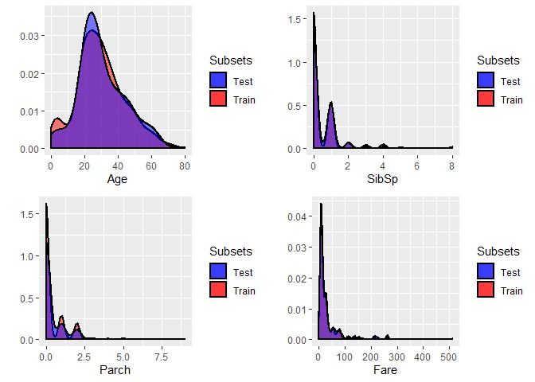
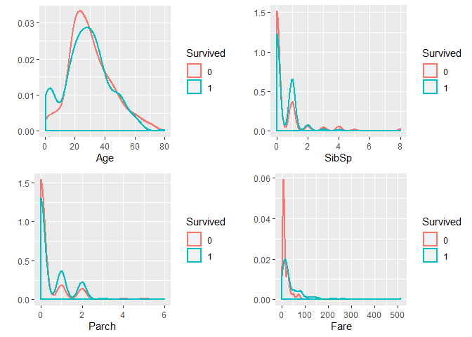
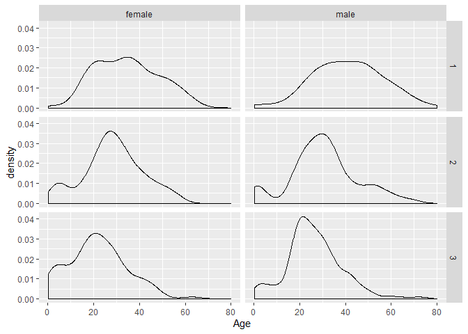
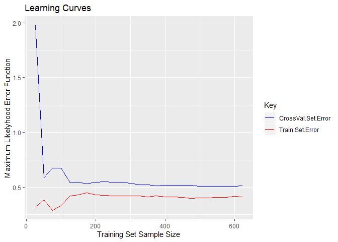

-   [Getting the Data](#getting-the-data)
-   [Data Pre-processing](#data-pre-processing)
-   [Exploratory Data Analysis](#exploratory-data-analysis)

    na.count = function (dat){
      dat %>% apply(., 2, is.na) %>% apply(.,2,sum) %>% .[.!=0]
    }

### Getting the Data

1.  We start by getting a sense of the training data and its structure.
2.  We add a column "Survived" to the test data and assign a default
    value of "0".
3.  Finally, we combide train and test data, for easier changes to the
    dataframe structure, imputing missing values and analysis

<!-- -->

    train = read.csv("../data/train.csv")

    head(train)

    ##   PassengerId Survived Pclass
    ## 1           1        0      3
    ## 2           2        1      1
    ## 3           3        1      3
    ## 4           4        1      1
    ## 5           5        0      3
    ## 6           6        0      3
    ##                                                  Name    Sex Age SibSp
    ## 1                             Braund, Mr. Owen Harris   male  22     1
    ## 2 Cumings, Mrs. John Bradley (Florence Briggs Thayer) female  38     1
    ## 3                              Heikkinen, Miss. Laina female  26     0
    ## 4        Futrelle, Mrs. Jacques Heath (Lily May Peel) female  35     1
    ## 5                            Allen, Mr. William Henry   male  35     0
    ## 6                                    Moran, Mr. James   male  NA     0
    ##   Parch           Ticket    Fare Cabin Embarked
    ## 1     0        A/5 21171  7.2500              S
    ## 2     0         PC 17599 71.2833   C85        C
    ## 3     0 STON/O2. 3101282  7.9250              S
    ## 4     0           113803 53.1000  C123        S
    ## 5     0           373450  8.0500              S
    ## 6     0           330877  8.4583              Q

    str(train)

    ## 'data.frame':    891 obs. of  12 variables:
    ##  $ PassengerId: int  1 2 3 4 5 6 7 8 9 10 ...
    ##  $ Survived   : int  0 1 1 1 0 0 0 0 1 1 ...
    ##  $ Pclass     : int  3 1 3 1 3 3 1 3 3 2 ...
    ##  $ Name       : Factor w/ 891 levels "Abbing, Mr. Anthony",..: 109 191 358 277 16 559 520 629 417 581 ...
    ##  $ Sex        : Factor w/ 2 levels "female","male": 2 1 1 1 2 2 2 2 1 1 ...
    ##  $ Age        : num  22 38 26 35 35 NA 54 2 27 14 ...
    ##  $ SibSp      : int  1 1 0 1 0 0 0 3 0 1 ...
    ##  $ Parch      : int  0 0 0 0 0 0 0 1 2 0 ...
    ##  $ Ticket     : Factor w/ 681 levels "110152","110413",..: 524 597 670 50 473 276 86 396 345 133 ...
    ##  $ Fare       : num  7.25 71.28 7.92 53.1 8.05 ...
    ##  $ Cabin      : Factor w/ 148 levels "","A10","A14",..: 1 83 1 57 1 1 131 1 1 1 ...
    ##  $ Embarked   : Factor w/ 4 levels "","C","Q","S": 4 2 4 4 4 3 4 4 4 2 ...

    test = read.csv("../data/test.csv")
    test$Survived = 0

    dat = rbind(train, test)
    indx = 1:nrow(train)

### Data Pre-processing

We run the following data pre-processing steps: 1. Convert the feature
type for `Survived`, `Pclass` from `<int>` to `<fctr>`. 2. Convert the
feature type for `Name`, `Cabin` from `<fctr>` to `<char>`. 3. Convert
the feature type for `Ticket` from `<fct>` to `<int>`.

Finally, we get separate the train and test data subsets.

    dat$Survived = factor(dat$Survived)
    dat$Pclass = factor(dat$Pclass)
    dat$Name = as.character(dat$Name)
    dat$Cabin = as.character(dat$Cabin)
    dat$Ticket = as.integer(dat$Ticket)
    str(dat)

    ## 'data.frame':    1309 obs. of  12 variables:
    ##  $ PassengerId: int  1 2 3 4 5 6 7 8 9 10 ...
    ##  $ Survived   : Factor w/ 2 levels "0","1": 1 2 2 2 1 1 1 1 2 2 ...
    ##  $ Pclass     : Factor w/ 3 levels "1","2","3": 3 1 3 1 3 3 1 3 3 2 ...
    ##  $ Name       : chr  "Braund, Mr. Owen Harris" "Cumings, Mrs. John Bradley (Florence Briggs Thayer)" "Heikkinen, Miss. Laina" "Futrelle, Mrs. Jacques Heath (Lily May Peel)" ...
    ##  $ Sex        : Factor w/ 2 levels "female","male": 2 1 1 1 2 2 2 2 1 1 ...
    ##  $ Age        : num  22 38 26 35 35 NA 54 2 27 14 ...
    ##  $ SibSp      : int  1 1 0 1 0 0 0 3 0 1 ...
    ##  $ Parch      : int  0 0 0 0 0 0 0 1 2 0 ...
    ##  $ Ticket     : int  524 597 670 50 473 276 86 396 345 133 ...
    ##  $ Fare       : num  7.25 71.28 7.92 53.1 8.05 ...
    ##  $ Cabin      : chr  "" "C85" "" "C123" ...
    ##  $ Embarked   : Factor w/ 4 levels "","C","Q","S": 4 2 4 4 4 3 4 4 4 2 ...

    train = dat[indx,]
    test = dat[-indx,]
    rm(dat)

### Exploratory Data Analysis

From the list of features available, it is reasonable to guess that the
survival of a passenger would likely **not** depend on `Name`, `Ticket`
and `Cabin`.

For the remaining features we get a distribution of their respective
values for the train and test subset to ascertain any significant
differences between the two.

    plot.age = ggplot()+ 
        geom_density(data = train, aes(x=Age, fill = "Train"), size = 1, na.rm = TRUE, alpha = 0.5)+ 
        geom_density(data = test, aes(x=Age, fill = "Test"), size = 1, na.rm = TRUE, alpha = 0.5)+
        scale_fill_manual(name = "Subsets", values = c(Train = "red", Test = "blue"))+ ylab("")
    plot.sibsp = ggplot()+ 
        geom_density(data = train, aes(x=SibSp, fill = "Train"), size = 1, na.rm = TRUE, alpha = 0.5)+ 
        geom_density(data = test, aes(x=SibSp, fill = "Test"), size = 1, na.rm = TRUE, alpha = 0.5)+
        scale_fill_manual(name = "Subsets", values = c(Train = "red", Test = "blue"))+ ylab("")
    plot.parch = ggplot()+ 
        geom_density(data = train, aes(x=Parch, fill = "Train"), size = 1, na.rm = TRUE, alpha = 0.5)+ 
        geom_density(data = test, aes(x=Parch, fill = "Test"), size = 1, na.rm = TRUE, alpha = 0.5)+
        scale_fill_manual(name = "Subsets", values = c(Train = "red", Test = "blue"))+ ylab("")
    plot.fare = ggplot()+ 
        geom_density(data = train, aes(x=Fare, fill = "Train"), size = 1, na.rm = TRUE, alpha = 0.5)+ 
        geom_density(data = test, aes(x=Fare, fill = "Test"), size = 1, na.rm = TRUE, alpha = 0.5)+
        scale_fill_manual(name = "Subsets", values = c(Train = "red", Test = "blue"))+ ylab("")
    grid.arrange(plot.age, plot.sibsp, plot.parch, plot.fare, ncol = 2)

    train.subset = table(train$Pclass) %>% prop.table() %>% round(4) %>% as.vector()
    test.subset = table(test$Pclass) %>% prop.table() %>% round(4) %>% as.vector()
    table.pclass = rbind(train.subset, test.subset); colnames(table.pclass) = levels(train$Pclass)
    writeLines("\nProportion of passengers stratified by Passenger Class")

    ## 
    ## Proportion of passengers stratified by Passenger Class

    table.pclass

    ##                   1      2      3
    ## train.subset 0.2424 0.2065 0.5511
    ## test.subset  0.2560 0.2225 0.5215

    train.subset = table(train$Sex) %>% prop.table() %>% round(4) %>% as.vector()
    test.subset = table(test$Sex) %>% prop.table() %>% round(4) %>% as.vector()
    table.sex = rbind(train.subset, test.subset); colnames(table.sex) = levels(train$Sex)
    writeLines("\nProportion of passengers stratified by Passenger Sex")

    ## 
    ## Proportion of passengers stratified by Passenger Sex

    table.sex

    ##              female   male
    ## train.subset 0.3524 0.6476
    ## test.subset  0.3636 0.6364

    train.subset = table(train$Embarked) %>% prop.table() %>% round(4) %>% as.vector()
    test.subset = table(test$Embarked) %>% prop.table() %>% round(4) %>% as.vector()
    table.embarked = rbind(train.subset, test.subset); colnames(table.embarked) = levels(train$Embarked) 
    writeLines("\nProportion of passengers stratified by Passenger Embarkation Port")

    ## 
    ## Proportion of passengers stratified by Passenger Embarkation Port

    table.embarked

    ##                          C      Q      S
    ## train.subset 0.0022 0.1886 0.0864 0.7228
    ## test.subset  0.0000 0.2440 0.1100 0.6459

There doesn't seem to be any meaningful difference in the distribution
of features between the train and test subset, except for `Embarked`
where the test subset has less of proportion of passengers boarding from
**S**. There seem to be some passengers in train subset that are
reporting `<blank>` under `Embarked` but there are none like these in
the test subset

We now get for the train subset features, distribution of their
respective values for the Survivors and non-Survivors

    plot.age = train %>% ggplot(aes(Age, color = Survived))+ geom_density(size = 1, na.rm = TRUE)+ ylab("")
    plot.sibsp = train %>% ggplot(aes(SibSp, color = Survived))+ geom_density(size = 1, na.rm = TRUE)+ ylab("")
    plot.parch = train %>% ggplot(aes(Parch, color = Survived))+ geom_density(size = 1, na.rm = TRUE)+ ylab("")
    plot.fare = train %>% ggplot(aes(Fare, color = Survived))+ geom_density(size = 1, na.rm = TRUE)+ ylab("")
    grid.arrange(plot.age, plot.sibsp, plot.parch, plot.fare)

    writeLines("\nSurvival Rate as a function of factor variables\n")

    ## 
    ## Survival Rate as a function of factor variables

    table(Survived = train$Survived, Pclass = train$Pclass) %>% prop.table(2) %>% round(digits = 4)

    ##         Pclass
    ## Survived      1      2      3
    ##        0 0.3704 0.5272 0.7576
    ##        1 0.6296 0.4728 0.2424

    table(Survived = train$Survived, Sex = train$Sex) %>% prop.table(2) %>% round(digits = 4)

    ##         Sex
    ## Survived female   male
    ##        0 0.2580 0.8111
    ##        1 0.7420 0.1889

    table(Survived = train$Survived, Embarked = train$Embarked) %>% prop.table(2) %>% round(digits = 4)

    ##         Embarked
    ## Survived             C      Q      S
    ##        0 0.0000 0.4464 0.6104 0.6630
    ##        1 1.0000 0.5536 0.3896 0.3370

    writeLines("\n")

    writeLines("The table below enumerates the features from the train dataset that report NA values and the count of NA values under respective features\n")

    ## The table below enumerates the features from the train dataset that report NA values and the count of NA values under respective features

    na.count(train)

    ## Age 
    ## 177

We note that: 1. There doesn't seem to be a correlation between
`Survived` and `Age`, or `SibSp`, or `Parch` or `Fare`. 2. There is a
definite correlation between `Survived` and `Pclass`, and `Sex`, and
`Embarked`. 3. There are some examples in train dataset that have a
`<blank>` under the `Embarked` feature and may need imputation. 4.
Finally, the `Age` feature reports 177 `NA`

We get some insight into `Age` by looking at its distribution along
`Pclass` and `Sex`. We also identify the passenger that are reporting
`<blank>` under `Embarked`.

    train %>% ggplot(aes(Age))+ geom_density(na.rm = TRUE)+ facet_grid(Pclass~Sex)

    writeLines("Who is reporting NA under Age?\n")

    ## Who is reporting NA under Age?

    table(Missing_Age = is.na(train$Age), Passenger_Class = train$Pclass, Sex = train$Sex) %>% 
        prop.table(margin = 2) %>% round(digits = 2)

    ## , , Sex = female
    ## 
    ##            Passenger_Class
    ## Missing_Age    1    2    3
    ##       FALSE 0.39 0.40 0.21
    ##       TRUE  0.04 0.01 0.09
    ## 
    ## , , Sex = male
    ## 
    ##            Passenger_Class
    ## Missing_Age    1    2    3
    ##       FALSE 0.47 0.54 0.52
    ##       TRUE  0.10 0.05 0.19

    writeLines("Who are the passengers reporing <blank> under Embarked?\n")

    ## Who are the passengers reporing <blank> under Embarked?

    train[train$Embarked == "", ]

    ##     PassengerId Survived Pclass                                      Name
    ## 62           62        1      1                       Icard, Miss. Amelie
    ## 830         830        1      1 Stone, Mrs. George Nelson (Martha Evelyn)
    ##        Sex Age SibSp Parch Ticket Fare Cabin Embarked
    ## 62  female  38     0     0     33   80   B28         
    ## 830 female  62     0     0     33   80   B28

1.  The age distributions are approximately normal in all the six
    classes; however their means differ - decreasing with passenger
    class and men being older than women. Also, the `NA` under `Age`
    come from all the six classes above. To impute missing values for
    `Age`, we get the median values for the six classes above

2.  Two passengers are reporing `<blank>` under `Embarked`; both are
    travelling together but without any other siblings or parents on
    board. To identify where these two passengers embarked, We get the
    median fares paid by passengers in first class from the 3
    embarkation ports to compare with the fare that these two passengers
    paid.

<!-- -->

    age.medians = train %>% group_by(Pclass, Sex) %>% summarise(med = median(Age, na.rm = TRUE))

    train %>% filter(Pclass == 1) %>% group_by(Embarked) %>% summarise(median(Fare))

    ## # A tibble: 4 x 2
    ##   Embarked `median(Fare)`
    ##   <fct>             <dbl>
    ## 1 ""                 80  
    ## 2 C                  78.3
    ## 3 Q                  90  
    ## 4 S                  52

1.  Comparing the fares they paid with median fares for other first
    class passengers, the 2 passengers with `<blank>` for `Embarked`
    most likely boarded from **C**. We therefore impute this value to
    `Embarked` in these two cases.
2.  We impute the median age of the class (function of `Pclass` and
    `Sex`) to `NA` under `Age`

<!-- -->

    train[train$Embarked == "", "Embarked"] = "C"
    train$Embarked = droplevels(train$Embarked)     #   Dropping the unused level
    test$Embarked = droplevels(test$Embarked)       #   Repeating the step above for test subset

    train[is.na(train$Age) & train$Pclass == 1 & train$Sex == "male", "Age"] = 
        age.medians[age.medians$Pclass == 1 & age.medians$Sex == "male", "med"]
    train[is.na(train$Age) & train$Pclass == 2 & train$Sex == "male", "Age"] = 
        age.medians[age.medians$Pclass == 2 & age.medians$Sex == "male", "med"]
    train[is.na(train$Age) & train$Pclass == 3 & train$Sex == "male", "Age"] = 
        age.medians[age.medians$Pclass == 3 & age.medians$Sex == "male", "med"]
    train[is.na(train$Age) & train$Pclass == 1 & train$Sex == "female", "Age"] = 
        age.medians[age.medians$Pclass == 1 & age.medians$Sex == "female", "med"]
    train[is.na(train$Age) & train$Pclass == 2 & train$Sex == "female", "Age"] = 
        age.medians[age.medians$Pclass == 2 & age.medians$Sex == "female", "med"]
    train[is.na(train$Age) & train$Pclass == 3 & train$Sex == "female", "Age"] = 
        age.medians[age.medians$Pclass == 3 & age.medians$Sex == "female", "med"]

    na.count(train)

    ## named integer(0)

We have now cleaned the train dataset.

1.  We make a reasonable assumption that the survival of a passenger is
    not dependent on his/her `Name`, `Ticket` and `Cabin`. For easier
    subsequent handling, we drop the non-essential features from the
    train subset. Finally, we save a baseline version of the updated
    train subset for future reference.
2.  We make the similar changes (of dropping the non-essential features)
    from the test subset and tabulate the missing data in the subset

<!-- -->

    feature.set = c("Survived", "Pclass", "Sex", "Age", "SibSp", "Parch", "Fare", "Embarked")
    train = train[, feature.set]
    saveRDS(train, "../RDA/train.Rda")

    test = test[, feature.set]

    writeLines("\n")

    writeLines("The table below enumerates the features from the test dataset that report NA values and the count of NA values under respective features\n")

    ## The table below enumerates the features from the test dataset that report NA values and the count of NA values under respective features

    na.count(test)

    ##  Age Fare 
    ##   86    1

1.  In the test subset, the `Age` feature reports 86 `NA`. To these, we
    impute the median age of the relevant class (function of `Pclass`
    and `Sex`) from the **train** subset.
2.  We also identify the passenger record reporting `NA` inder `Fare`

<!-- -->

    test[is.na(test$Age) & test$Pclass == 1 & test$Sex == "male", "Age"] = 
        age.medians[age.medians$Pclass == 1 & age.medians$Sex == "male", "med"]
    test[is.na(test$Age) & test$Pclass == 2 & test$Sex == "male", "Age"] = 
        age.medians[age.medians$Pclass == 2 & age.medians$Sex == "male", "med"]
    test[is.na(test$Age) & test$Pclass == 3 & test$Sex == "male", "Age"] = 
        age.medians[age.medians$Pclass == 3 & age.medians$Sex == "male", "med"]
    test[is.na(test$Age) & test$Pclass == 1 & test$Sex == "female", "Age"] = 
        age.medians[age.medians$Pclass == 1 & age.medians$Sex == "female", "med"]
    test[is.na(test$Age) & test$Pclass == 2 & test$Sex == "female", "Age"] = 
        age.medians[age.medians$Pclass == 2 & age.medians$Sex == "female", "med"]
    test[is.na(test$Age) & test$Pclass == 3 & test$Sex == "female", "Age"] = 
        age.medians[age.medians$Pclass == 3 & age.medians$Sex == "female", "med"]

    test[is.na(test$Fare),]

    ##      Survived Pclass  Sex  Age SibSp Parch Fare Embarked
    ## 1044        0      3 male 60.5     0     0   NA        S

1.  The passenger record reporting `NA` under `Fare` also reports
    `Pclass` = 3 and `Embarked` = S. To this `NA`, we impute the median
    value of the respective class (function of `Pclass` and `Embarked`)
    from the train subset.
2.  We confirm that the train subset is now clean and save a baseline
    for future reference.

<!-- -->

    test[is.na(test$Fare), "Fare"] = train %>% filter(Pclass == 3 & Embarked == "S") %>% 
                                            summarise(med = median(Fare))
    na.count(test)

    ## named integer(0)

    saveRDS(test, "../RDA/test.Rda")

Before proceeding further with feature engineering, it would be
worthwhile to draw some Learning Curves to estimate if a basic
logistical regression model suffers from high bias or high variance.
This will inform our feature engineering better.

    # We divide the training data into a training set and a validation set in the ratio of 70:30
    set.seed(1970)
    indx = sample(nrow(train), 0.7*nrow(train), replace = FALSE)
    lc.steps = 25; lc.step.size = length(indx)/lc.steps
    lc.set.size = seq(lc.step.size, length(indx), length.out = lc.steps) %>% round(digits = 0)

    err.train = rep(0, lc.steps); err.val = err.train
    for (i in 1:lc.steps) {
      glm.fit = glm(Survived~., data = train[indx[1:lc.set.size[i]],], 
                    family = "binomial")
      prob = predict(glm.fit, newdata = train[indx[1:lc.set.size[i]],], type = "response")
      y = train$Survived[indx[1:lc.set.size[i]]]
      y = levels(y)[y] %>% as.numeric()
      err.train[i] = sum(-y*log(prob) - (1-y)*log(1-prob))/(length(y))

      prob = predict(glm.fit, newdata = train[-indx,], type = "response")
      y = train$Survived[-indx]
      y = levels(y)[y] %>% as.numeric()
      err.val[i] = sum(-y*log(prob) - (1-y)*log(1-prob))/(length(y))
    }

    err.df = cbind(Size = lc.set.size, Train = err.train, Val = err.val) %>% as.data.frame()

    err.df %>% ggplot(aes(x = Size)) + geom_line(aes(y = Train, color = "Train.Set.Error"))+ 
        geom_line(aes(y = Val, color = "CrossVal.Set.Error"))+ 
        labs(title = "Learning Curves", x = "Training Set Sample Size", y = "Maximum Likelyhood Error Function")+
        scale_colour_manual(name="Key", values=c(Train.Set.Error ="red", CrossVal.Set.Error ="blue"))

The rapid and almost converged learning curves for train set and
cross-validation set indicate that an un-penalised logistic regression
model will suffers from high bias and if we are to improve the
performance of out model then we will to build a model that uses
additional features (feature interaction terms, feature power terms,
etc).

To help evaluate the relative performance of differnt models built, we
will establish a baseline performance measure for test set prediction
accuracy using an un-penalised logistic regression model.

    m = nrow(train)
    est.test.err = 0
    for (k in 1:5) {
        set.seed(k)
        indx = sample(1:m, 0.75*m)
        glm.fit = glm(Survived~., data = train[indx,], family = "binomial")
        prob = predict(glm.fit, newdata = train[indx,], type = "response")
        pred = prediction(prob, train$Survived[indx])
        perf = performance(pred, measure = "acc")
        max.acc.indx = perf@y.values %>% unlist() %>% as.vector() %>% which.max()
        bestcutoff = perf@x.values %>% unlist %>% as.vector() %>% .[max.acc.indx]
        
        prob = predict(glm.fit, newdata = train[-indx,], type = "response")
        pred = ifelse(prob < bestcutoff, 0, 1)
        test.err = mean(pred != train$Survived[-indx])
        est.test.err = test.err + est.test.err
    }

    print(paste("The estimated test error using an unpenalised logistic regression is", 
                round(est.test.err/5, digits = 4), sep = " "))

    ## [1] "The estimated test error using an unpenalised logistic regression is 0.1839"

We will build different types of prediction models:

1.  Parametric Models
    1.  Un-penalised logistic regression with feature engineering
    2.  SVM with different kernels
    3.  Neural Networks
2.  Non-parametric models
    1.  K nearest Neighbours
    2.  Tree based
